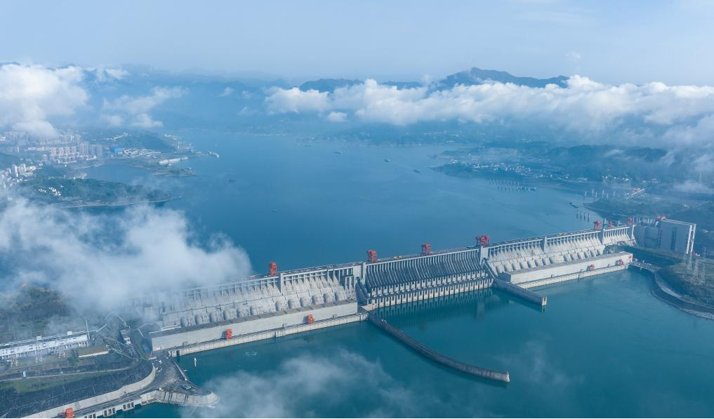
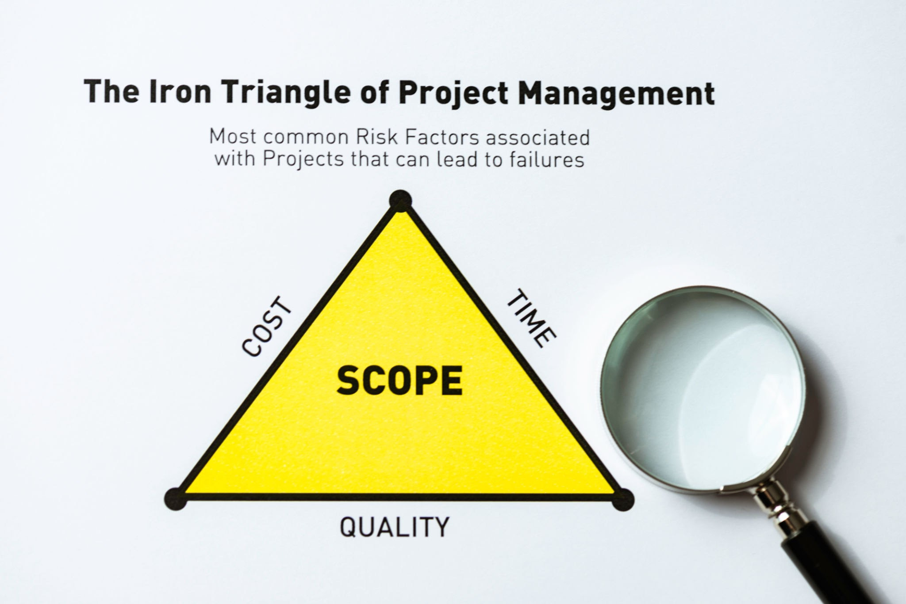
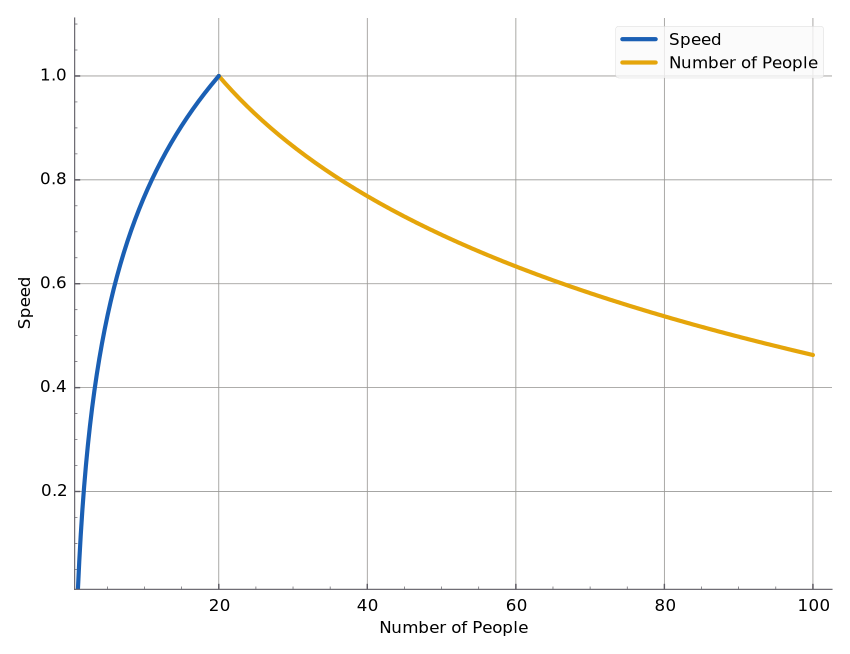
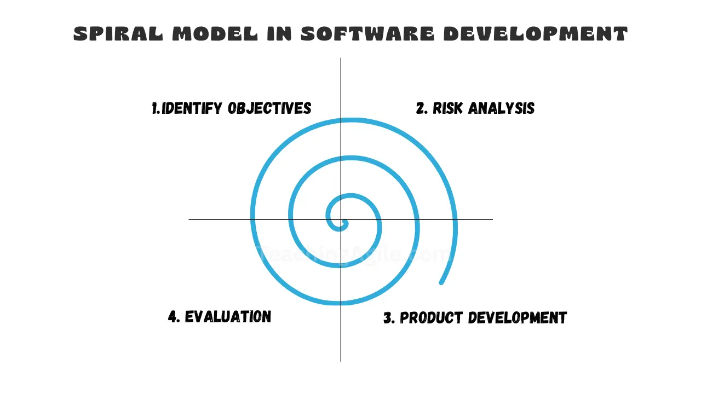
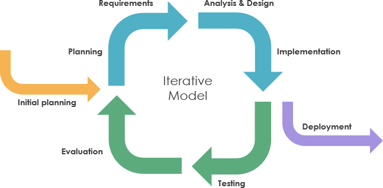
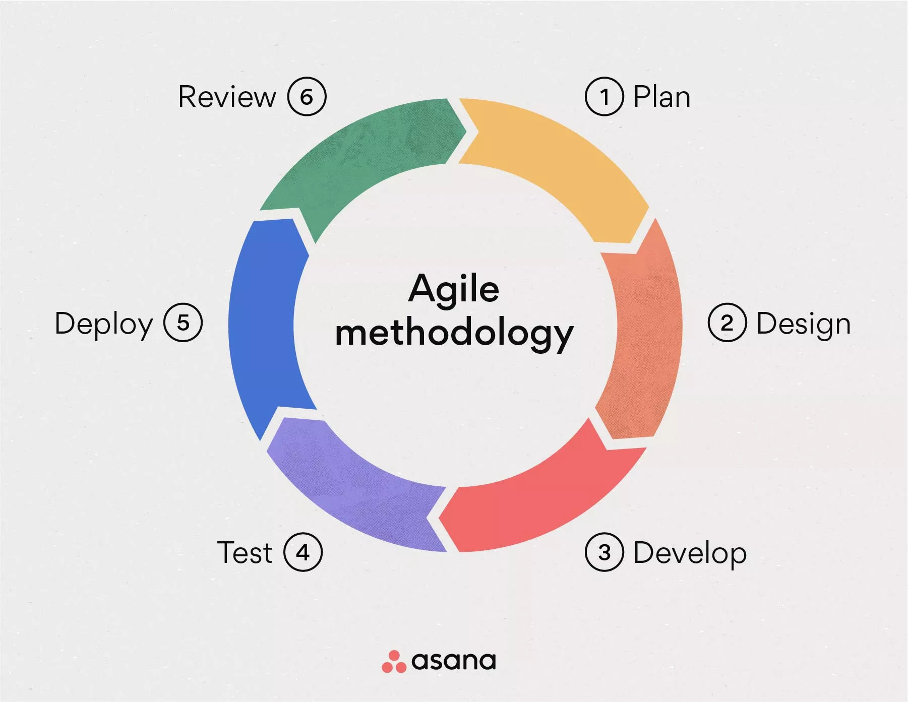

# Project Management
## Lecture 1
### Introduction 
**2025-2026**
---

```yaml
hideInToc: true
```
# Table of Content
<toc/>

---

# Project
## What Is A Project
- A project is defined as a temporary endeavor to create a distinct product, service or result.
- The project must have a distinct product, service or result (target of the project)
- In order to hit the target we need a clearly defined goals, in other words, we need to define the resulting product, service or result we aim to acquire from the project.
- This is the MOST important part of project, for it defines how to measure the target of the project and decide it success or failure.

---

```yaml
hideInToc: true
```
# Project
## What Is A Project
- The type of the project target defines how we need to manage the project.
	- If the target of the project is a product, we must have a product that satisfies the specs provided by the clients
	- If we are working in the humanitarian sector, the target differs, it is no longer a product or profit, but in number of people or families we were able to help
		- For example a legal service assisting people in navigating the complexities of marriage documents, birth certificates and divorce procedures measures in number of helped individuals
		- We're providing a relief aid to IDPs (Internally Displaced Person), usually it is measured in number of familiess
- In the context of the entire course, the word 'organization' refers to any public, private or publicly traded company, governmental body, Non-Governmental Organization (NGO), Non-Profit Organization or any other type of organizational body that works on or benefits from a project.
---

# Components of Project
- A Project has multiple components
	1. Target (Goal)
	2. Resources
	3. Stakeholders
	4. Clients/Customers
---

```yaml
hideInToc: true
```
# Components of Project
## Target (Goal)
- In order to say we are working on a project, we need to have a goal or target to hit
- The target can be:
	1. A unique full or partial product  (a new engine for a new car)
	2. A unique service or the ability to provide a unique service
	3. A master's/PhD thesis or patent
	4. Mix of the above
---

```yaml
hideInToc: true
```
# Components of Project
## Resources
- In order to work on a project, we need to have a set of resources:
	1. Financial Resources (budget and money) 
	2. Special Materials
	3. People
	4. Time table for project execution
---

```yaml
hideInToc: true
```
## Components of Project
## Resources
1. Financial Resources:
	- The budget represents the expected cost of the project
	- The cost is the actual money spent on project
	- We need to align the cost as close as possible to the budget
		- The relationship between cost and budget has 3 types:
			- Budget Balance: the cost === budget
			- Budget Surplus: the cost < budget
			- Budget Deficit: the cost > budget
			- Having surplus is best case scenario, while deficit is the worst case, as for balance, it is considered to be the norm
---

```yaml
hideInToc: true
```
# Project
## Components of Project
### Resources
1. Financial Resources:
	- Why might we be in a budget deficit?
		- The planning is poor and didn't consider all the possible expected expense in the budget
		- A change in material prices prior to purchase and acquire
		- A big change in the economic climate during execution (increment or decrement in foreign exchange rate/gold, a change in the laws where we are executing the project that causes extra new expenses, economic sanctions)
		- Accidents during execution, like injury because of lacking in safety procedures resulting in large settlement payouts.
		- Unexpected changes due to new discovers during the execution
		- Inspections that indicates non compliance with safety standards or  specs causing a redo of a section of the project
--- 

```yaml
hideInToc: true
```
# Components of Project
## Resources
1. Financial Resources: Examples of projects that ran a budget deficit:
	1.  **The Channel Tunnel (نفق المانش):**
		- An underwater tunnel connection England with France allowing train passage
		The initial budget was 5.5B Pounds Sterling, but the actual cost is 9.5B Pounds Sterling
		The deficit came due to unexpected type of soil they were digging through in geological terms
	2.  **1976 Olympiad Canada**
		- The budget for the project was 300M Canadian Dollars, the cost is 1.5B Canadian Dollars
		The main cost was the stadium, it cost about 700M Candaian Dollars due worker strikes, increase in material prices and bad weather
---

```yaml
hideInToc: true
```
# Components of Project
## Resources
1. Financial Resources: Examples of projects that ran a budget deficit:

	3. F-35 Lighting Program
		 - The crown jewel of the US Air force
		Designed as replacement for the aging F-22 Raptor
		Had several unique design elements, like single engine (F-22 had dual engine) and some versions support VTOL (Vertical Take Off and Landing)
		Several versions were developed (Air force, Naval Air force, Marines)
		The coast reached 1.7T $ (88% deficit) and 10 years late to the party
		This mostly related to how US approves and finances defense contracts

*This is the not scope of the course, however arms manufacturers and defense contractors in USA have found a system in which the US government must fund defense project despite being over budget(deficit) and over time.*

---

```yaml
hideInToc: true
```
# Components of Project
## Resources
2. Material:
	- A set of needed material to achieve the target, for example:
		1. Construction material (Cement, Cinder Blocks, ...etc)
		2. Switching Board
		3. Servers
		4. Network infrastructure, surveillance and alarm system
		5. Furniture
	- Material prices often fluctuate during execution as a result of changes in economic conditions, the political climate, or even legislation.
		- For example, tariffs imposed by the U.S. President on various imported materials caused significant shifts in ongoing projects regarding both material costs and market availability.
---

```yaml
hideInToc: true
```
# Components of Project
## Resources
2. Material:
	- One of the biggest challenges is ensuring the availability of materials within the local market; otherwise, we are forced to import from foreign markets. This can drive up costs, as the per-unit cost of importing a single item is much higher than importing in bulk.
---

```yaml
hideInToc: true
```
# Project
## Components of Project
## Resources
3. People
	- They are the people executing the project to hit the target/goal
	- In general having more than one person in the room will cause conflict
	- As a result one of the main duties of a project manager is conflict resolution between individuals
		- Sometimes, everything falls into place and the people continue to work together
		- Sometimes you need to shuffle teams to make sure the individuals in conflict DO NOT interact with each other.
		- Sometimes you have to fire someone.
--- 

```yaml
hideInToc: true
```
# Components of Project
## Resources
3. People
	- A MAJOR requirement for project manager is to divide tasks on individuals based on their experience and knowledge
		- You cannot assign IT to civil engineering duties (different education)
		- A medical doctor cannot do the same things as a farmer (different experience)
		- In short, when dividing tasks between individuals we must take into consideration their knowledge, education and experience.
--- 

```yaml
hideInToc: true
```
# Components of Project
## Resources
4. Time Table
	- Every project as a time limit
	- Meaning a start date and finish date
	- Thus, we need to create a table indicating the various tasks of a project and the time limit per task in order to hit the finish date
	- Usually there is a liability clause in the project contract regarding the execution time:
		- Ensuring bonuses in case of finishing within specs before the end date
		- Financial penalties in case of finishing after the end date or outside the specs
--- 

```yaml
hideInToc: true
```
# Components of Project
## Resources

<div grid="~ cols-2 gap-4">
<div>

4. Time Table
	- The limited time to execute the project doesn't mean it is short.
	- It can take years to finish the project like the largest dam in the world on Yangtze river in China, The 3 Gorges Dam.
	- This is the biggest dam on the world, construction started in 1994 and finished in 2012 with 2.3KM body length
	- In 2015 the increased the height of the dam because it stores more than expected amount of water
</div>
<div>



*P.S. this dam has a ship lift !*
</div>
</div>
---

```yaml
hideInToc: true
```
# Components of Project
## Resources
4. Time Table
	- We say we finished the project in the following cases:
		1.  We achieved the goal: we were able to create product/ provide the required service/result
		2. Unattainable target (goal): As the execution progresses, we realize the target of the project cannot be achieved for a variety of reasons, like what happened to India when the tried to compete with Taiwan in the 1990s in manufacturing chips but failed
		3. The need of the project no longer exists: one way or another the reason behind the project ceases to exist.
		4. End of financial Commitment: No more money for you
		5. Human and/or physical resources no longer available: This is happening right now to TSMC, as they are trying to build new chip manufacturing plants in the USA, they ran into scarcity of skilled and experienced engineers to run these facilities as a result the opening date has been pushed from 2024 to 2025 for the first one and to 2027 or 2028 for the second one.
---

```yaml
hideInToc: true
```
# Components of Project
## Resources
4. Time Table
	- We say we finished the project in the following cases:
		6. Legal reasons: Encroaching on other piece of land, violating a patent or existing laws
	- The last 3 reasons can cause a project to stop completely or temporary:
		- We can secure new source of funding, solve legal issues, provide new sources for materials and hire new skilled workers, but at a significant financial burden.
		- First things first, the income from the project will be delayed, also solving legal issues might require payment for fines and settlements. 
		- New sources of materials might be more expensive and new hires are defiantly more expensive than old hires.
---

```yaml
hideInToc: true
```
# Components of Project
## Stakeholders
<div grid="~ cols-2 gap-4">
<div>

- Who are the stakeholders?
	- They are individuals, groups or organizations interested in the goal of the project, they might be clients, but it is generally more broad than that.

</div>
<div>

</div>
</div>
---

```yaml
hideInToc: true
```
# Components of Project
## Stakeholders
<div grid="~ cols-2 gap-4">
<div>

- Who are the stakeholders?
	- Let's take an example to understand who stakeholders are:
		- You are a publicly traded company, the stakeholders in this case are the shareholders represented by the board of directors
		- You are a public company, funded by the government, the stakeholders are the tax payers, who are at the same time the clients
		- You are an NGO operating in the humanitarian sector, the benefactors are the stakeholders
</div>
<div>

</div>
</div>
---

```yaml
hideInToc: true
```
# Components of Project
## Stakeholders
<div grid="~ cols-2 gap-4">
<div>

- Their interests vary, encompassing financial, social, and organizational aspects. Their involvement can influence the success of the project or be impacted by it. 
- In the context of a software project, stakeholders may include:
	- Customers  
	- Employees
	- Investors (Funders)
	- Regulatory bodies
	- The software’s end-users
</div>
<div>

</div>
</div>
---

```yaml
hideInToc: true
```
# Components of Project
## Clients/Customers
- Who are Clients?
	- Definition: Clients are individuals or organizations that purchase or utilize a specific product or service.
	- The Relationship: Unlike a random "customer" who might have a one-time transaction, a client usually has a direct, ongoing relationship with the service provider or company. This often involves a contract or a professional partnership.
---

```yaml
hideInToc: true
```
# Components of Project
## Clients/Customers
- **Clients/Customers vs Stakeholders** 

| **Feature**       | **Clients**                                                   | **Stakeholders**                                                                     |     |
| ----------------- | ------------------------------------------------------------- | ------------------------------------------------------------------------------------ | --- |
| **Scope**         | A specific subset focused strictly on the product or service. | The "umbrella" term for everyone with an interest in the project's outcome.          |     |
| **Primary Focus** | The quality, utility, and value of the final deliverable.     | Often centered on financial returns, ROI, or strategic alignment.                    |     |
| **Relationship**  | Usually a transactional or exchange-based partnership.        | Varying levels of influence and engagement (from passive investors to active users). |     |
| **Interests**     | Driven by satisfaction and problem-solving.                   | Often have diverse—and sometimes conflicting—interests.                              |     |

---

# Results of Project
- Any project must have a various tangible and intangible results
- Tangible Results:
	- Financial Profit
	- Shares for shareholders (stakeholders)
	- New tools
	- Market share
- Intangible Results:
	- Good reputation
	- Spreading the trademark
	- General benefit
--- 

# Project Management
## Definition
<div grid="~ cols-2 gap-4">
<div>

- **Definition 1:** Project Management is the application of knowledge, skills, tools, and techniques to project activities to meet the project requirements and goals.  
- **Definition 2:** It can also be defined as the management of various resources used in completing a specific project to achieve the desired results within the shortest possible time and at the lowest possible cost with the highest possible quality. Any change in one side of the triangle, will affect the other parts
</div>
<div>

</div>
</div>
---


```yaml
hideInToc: true
```
# Project Management
## Definition
- Successful Project Management Enables Individuals, Groups, and Organizations to:
<div grid="~ cols-2 gap-4">
<div>

1. Achieve business objectives
2. Satisfy stakeholder expectations
3. Increase predictability of outcomes
4. Enhance chances of success
5. Deliver the right product at the right time
6. Solve problems effectively
</div>
<div>

7. Respond to risks in a timely manner
8. Optimize the investment of organizational resources
9. Identify, address, or terminate failing projects
10. Manage constraints and balance their varying impacts
11. Manage changes in a timely fashion
</div>
</div>
---


```yaml
hideInToc: true
```
# Project Management
## Definition
- The Consequences of Poor Project Management:
	1. **Missed Deadlines:** Overstepping time constraints and delivery dates.    
	2. **Budget Overruns:** Uncontrolled increase in costs and resource spending.    
	3. **Poor Quality:** Delivering a product that is buggy, unreliable, or fails to meet standards.    
	4. **Project Rework:** Being forced to redo work due to errors or lack of clarity—a major productivity killer.    
	5. **Scope Creep:** Unplanned and uncontrolled expansion of the project requirements.    
	6. **Reputational Damage:** Loss of credibility for the organization or team.    
	7. **Stakeholder Dissatisfaction:** Frustrated clients, investors, or users.    
	8. **Failed Objectives:** Complete failure to achieve the original goals of the project.
---

# Importance of Project Management
- The importance of project management stems from the importance of projects themselves, as projects are the primary method through which value is generated for the organization.
- In the contemporary business environment, managers must handle smaller budgets, shorter timelines, limited resources, and rapid technological changes to achieve organizational profitability.
- The business environment is characterized as dynamic with a rapid rate of change, requiring companies to adopt project management to achieve effective organizational oversight and realize profits.
- Successful project management allows the organization to:
    1. Link project outcomes to the organization's business objectives.
    2. Compete effectively in the market.
    3. Ensure organizational sustainability.
    4. Respond to changes in the business environment by adjusting project plans.
---

# Project Life Cycle
- It is the series of phases that a project passes through from its initiation until it achieves its final objectives.
- These phases exist in every project's life, regardless of the specific execution methodology used (such as Waterfall or Agile).
- It includes the following steps:
    1. **Initiation (Start):** In this stage, the project's goals are defined by communicating with the client and understanding their specific needs.
    2. **Planning (Plan):** In this stage, the project timeline is established, costs are estimated, and the tools required for execution are identified. This is considered the most critical step in management because the entire execution depends on it.
    3. **Execution (Execute):** In this stage, the project is fully implemented according to the established schedule and budget.
    4. **Closing (Finish):** The project is finalized, quality testing is performed, and the final deliverable is handed over to the client.
---

# Project Life Cycle
<div class="text-center">


</div>
---

# Project Manager
- **Formal Definition:** The Project Manager is the individual responsible for applying project management methodology to a project to achieve its results within the available resources and constraints.
- **Informal Definition:** A person who is fully convinced that nine women can deliver a fully-grown baby in a single month.
	- This informal definition is derived from a very important mechanism: **Resource Management**. The Project Manager must manage available resources (materials/money, people, time) to complete the project within the imposed constraints (quality, cost, and time) in a way that satisfies both stakeholders and the client.
	- Consequently, it has become "common practice" to increase the number of individuals working on a project to speed up execution.
	- However, just like human pregnancy, this does not always achieve the desired speed.
--- 

```yaml
hideInToc: true
```
# Project Manager
<div grid="~ cols-2 gap-4">
<div>

- The manager’s primary task is to manage resources in a way that ensures the best possible project execution.
- If the project execution is slow and there is a financial surplus, the manager may work on adding more individuals to the team.
- Naturally, this increase has limits; after a certain threshold of additional personnel, performance collapses and speed decreases.
</div>
<div>

</div>
</div>
---

```yaml
hideInToc: true
```
# Project Manager
<div grid="~ cols-2 gap-4">
<div>

- The primary reason for this performance collapse is that the majority of time shifts toward managing teams and resolving interpersonal or inter-departmental conflicts, rather than focusing on execution and solving problems related to creating the new product or service.
</div>
<div>

</div>
</div>
---

```yaml
hideInToc: true
```
# Project Manager
<div grid="~ cols-2 gap-4">
<div>

- **The Breaking Point:** This threshold varies from one project to another based on the project's scale:
	- Developing a massive game like **Cyberpunk 2077** can support and requires a large number of programmers.
	- Developing a simple application, such as a **WordPress** site, does not require such a high headcount.
- **The Manager's Role:** Therefore, the core job of a Project Manager is to avoid reaching this breaking point and to maintain the highest level of performance without hitting the stage where speed begins to decline.
</div>
<div>

</div>
</div>
---

```yaml
hideInToc: true
```
# Project Manager
- Generally, as a Project Manager, you must:
	- **Analyze the project idea** and extract actionable objectives from it.
	- **Establish the project schedule** (timeline) for execution.
	- **Develop the project budget.**
	- **Conduct an economic feasibility study** (determining if the financial expenditure is justifiable and recoverable).
	- **Monitor and track execution.**
	- **Resolve conflicts** that arise between team members, stakeholders, and clients.
	- **Address shortages** in materials or labor using the best available methods.
Project management is fundamentally tied to your interpersonal skills and ability to deal with people, not just the technologies and tools we use.
---

# Relationship with Software Development
## Development Models
- In software engineering, we have several models to develop software:
	- Waterfall
	- Spiral
	- Iterative
	- Agile
- They represent the life cycle of the project, they are **NOT** project management, they are a **PART** of project management
---

```yaml
hideInToc: true
```
# Relationship with Software Development
## Development Models
- Waterfall

---

```yaml
hideInToc: true
```
# Relationship with Software Development
## Development Models
- Spiral

---

```yaml
hideInToc: true
```
# Relationship with Software Development
## Development Models
- Iterative

---

```yaml
hideInToc: true
```
# Relationship with Software Development
## Development Models
- Agile

---
# Now what?
- We will cover the following concepts:
	1. Time Management in Project
	2. Budgeting
	3. DevOps
		1. Git
		2. Docker
		3. CI/CD
	4. Agile