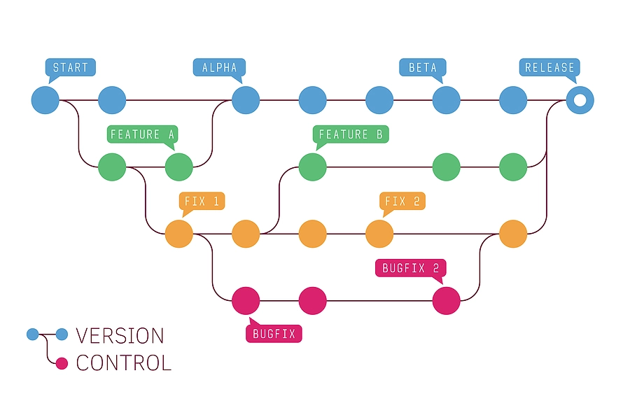
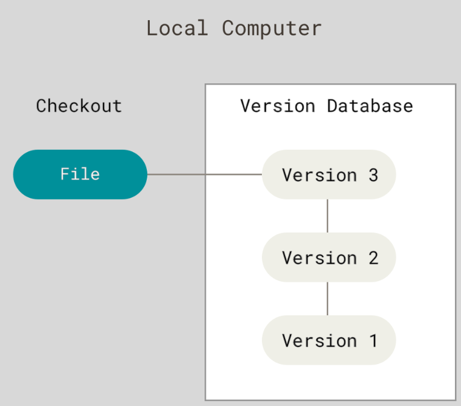
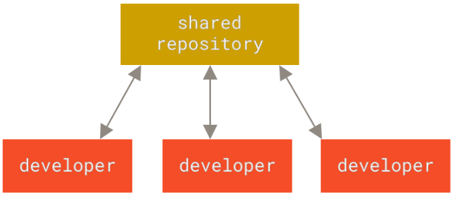
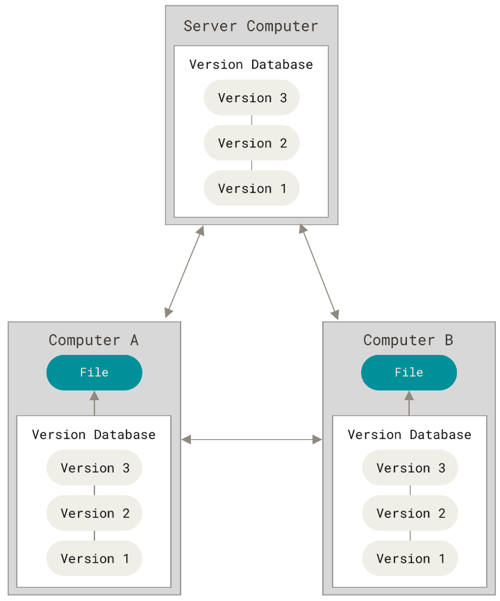
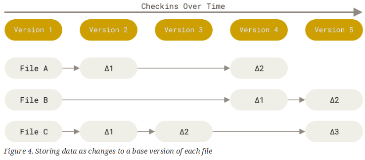
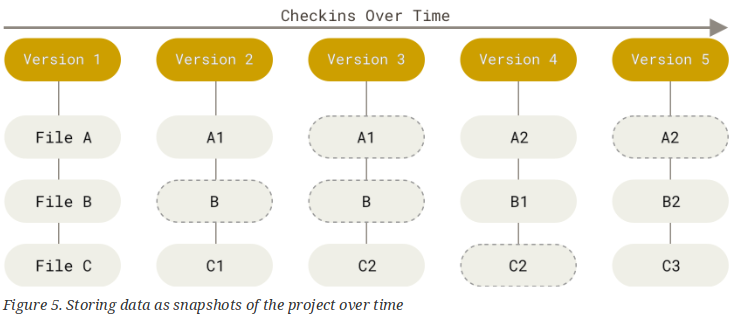
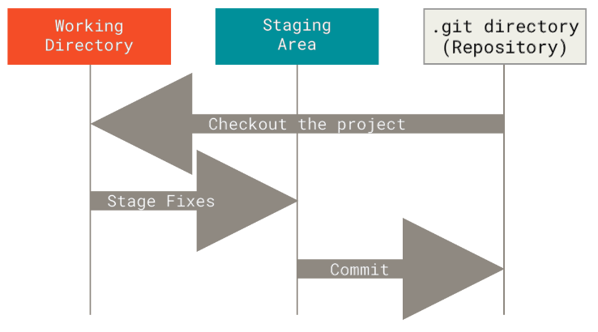

- <v-click at="1">You are sitting at you're desk, working, watching memes, and above all watching the new sick anime called Rooster Fighter about a rooster fighting demons</v-click>
- <v-click at="2">Suddenly, volcanoes erupt, the earth shakes, aliens invade, demons from hell appears and to top it all, Harry Maguire (The Man United defender) wins the Ballon D'or</v-click>
- <v-click at="3">"This is it, it is happening", that's what you say to yourself as the training kicks in, "I must do it"</v-click>
- <v-click at="4">So you:</v-click>
	- <v-click at="5">git commit</v-click>
	- <v-click at="6">git push</v-click>
	- <v-click at="7">GET OUT</v-click>
	
---

```yaml
hideInToc: true
layout: cover
class: text-center
```

# Project Management
## Lecture 2
### VCS: GIT 
**2025-2026**
---

```yaml
hideInToc: true
```
# Table of Content:
<toc />

---

# Version Control System
- Version control is a system that records changes to a file or set of files over time so that you can recall specific versions later
- In other words, you use it to track changes you do to file and undo changes and revert back to old state
<div grid="~ cols-2 gap-1">
<div>

- if you are a graphic or web designer and want to keep every version of an image or layout a Version Control System (VCS) is a very wise thing to use.
- It allows you to revert selected files back to a previous state
- Or revert the entire project back to a previous state
- Compare changes over time, see who last modified something that might be causing a problem, who introduced an issue and when (git blame) and more
</div>
<div>

</div>
</div>
---

```yaml
hideInToc: true
```
# Version Control System
- The types of VCS:
	- Local
	- Centralized
	- Decentralized
---

```yaml
hideInToc: true
```
# Version Control System
<div grid="~ cols-2 gap-1">
<div>

- Local VCS:
	- local VCS has a simple database that kept all the changes to files under revision control
	- One of the most popular VCS tools was a system called RCS, which is still distributed with many computers today.
	- RCS works by keeping patch sets (that is, the differences between files) in a special format on disk
	- it can then re-create what any file looked like at any point in time by adding up all the patches.
</div>
<div>

</div>
</div>
---

```yaml
hideInToc: true
```
# Version Control System
<div grid="~ cols-2 gap-1">
<div>

- Centralized Version Control Systems
	- In order to collaborate with developers on other systems. Centralized Version Control Systems (CVCSs) were developed.
	- These systems (such as CVS, Subversion, and Perforce) have a single server that contains all the versioned files, and a number of clients that check out files from that central place
</div>
<div>

</div>
</div>
---

```yaml
hideInToc: true
```
# Version Control System
<div grid="~ cols-2 gap-1">
<div>

- Centralized Version Control Systems
	- This setup offers many advantages, especially over local VCSs.
	- For example, everyone knows to a certain degree what everyone else on the project is doing.
	- Administrators have fine-grained control over who can do what, and it’s far easier to administer a CVCS than it is to deal with local databases on every client.
</div>
<div>

</div>
</div>
---

```yaml
hideInToc: true
```
# Version Control System
<div grid="~ cols-2 gap-1">
<div>

- Centralized Version Control Systems
	- However, this setup also has some serious downsides.
	- The most obvious is the single point of failure that the centralized server represents.
	- If that server goes down for an hour, then during that hour nobody can collaborate at all or save versioned changes to anything they’re working on
</div>
<div>

</div>
</div>
---

```yaml
hideInToc: true
```
# Version Control System
<div grid="~ cols-2 gap-1">
<div>

- Distributed Version Control Systems
	- In a DVCS (such as Git, Mercurial or Darcs), clients don’t just check out the latest snapshot of the files
	- They fully mirror the repository, including its full history.
	- Thus, if any server dies, and these systems were collaborating via that server, any of the client repositories can be copied back up to the server to restore it.
</div>
<div>

</div>
</div>
---

# The History of Git
- The Linux kernel is an open source software project of fairly large scope.
- During the early years of the Linux kernel maintenance (1991–2002), changes to the software were passed around as patches and archived files.
- In 2002, the Linux kernel project began using a proprietary DVCS called BitKeeper.
- In 2005, the relationship between the community that developed the Linux kernel and the commercial company that developed BitKeeper broke down, and the tool’s free-of-charge status was revoked.
- At this point Linus Torvalds, the creator of Linux said: **"Fine I'll code it myself"**
---

```yaml
hideInToc: true
```
# The History of Git
- For the next 6 months, Linus worked on Git.
	- This man is overpowered (OP) that after day 1 git was tracking itself
- After 6 months, Linus "dumped" git to the community, Especially Junio Hamano and went to back to Linux
- Some of the goals of the new system were as follows:
	- speed
	- Simple design
	- Strong support for non-linear development (thousands of parallel branches)
	- Fully distributed
	- Able to handle large projects like the Linux kernel efficiently (speed and data size
- Later Github appeared and it played a vital roles in making Git mainline
---

# Git Structure
- Difference Storage:
	- Most other systems store information as a list of file-based changes.
	- These other systems (CVS, Subversion, Perforce, and so on) think of the information they store as a set of files and the changes made to each file over time (this is commonly described as delta-based version control)

---

```yaml 
hideInToc: true
```
# Git Structure
- Snapshot Storage:
	- Git thinks of its data more like a series of snapshots of a miniature filesystem.
	- With Git, every time you commit, or save the state of your project, Git basically takes a picture of what all your files look like at that moment and stores a reference to that snapshot.
	- To be efficient, if files have not changed, Git doesn’t store the file again, just a link to the previous identical file it has already stored.
	- Git thinks about its data more like a stream of snapshots.

---

```yaml 
hideInToc: true
```
# Git Structure
- Why Git is better ?
	- Because by storing snapshots you restore the entire file, by storing changs you have to restore all previous version of the file in correct order before you get the current version
	- In case of corruption in any change, the file cannot be restored successfully
	- Everything in Git is checksummed before it is stored and is then referred to by that checksum.
	- This means it’s impossible to change the contents of any file or directory without Git knowing about it.
	- This functionality is built into Git at the lowest levels and is integral to its philosophy. You can’t lose information in transit or get file corruption without Git being able to detect it.
	- The mechanism that Git uses for this checksumming is called a SHA-1 hash
	- When you do actions in Git, nearly all of them only add data to the Git database.
---

# The Stages of Git
- Any repository in git has 3 stages:
	- modified: means that you have changed files but have not committed them to your database yet
	- staged: means that you have marked a modified files in its current version to go into your next commit snapshot.
	- committed: Committed means that the data is safely stored in your local database
	
---

# Git: Branches
- branches provide an isolated environment for the developer to work.
- They are also useful for organizing different levels of granularity.
- For instance, in what is known as the Git-Flow, there are three important branches: master, staging, and develop.
- One of Git's biggest advantages is its branching capabilities. This allows someone to branch off of the master branch (where the production-quality code typically remains) and work on a feature or fix independently of the rest of the project.
- Once they finish their work, they can merge the branch back into the master branch with the click of a button.
- branches provide an isolated environment for the developer to work. They are also useful for organizing different levels of granularity. For instance, in what is known as the Git-Flow, there are three important branches: master, staging, and develop. 
---

```yaml
hideInToc: true
```
# Git: Branches
- Master (main) is the parent branch, representing the state of the project that is released to the public (deployed).
- The staging branch is where pre-release QA is done.
- Develop is where developers work on the project.
---

# Git: The CLI
- There are GUI tools for get, by they encapsulate the Git CLI
- There are a lot of commands, we will look at:
	- init
	- branch
	- pull
	- push
	- checkout
	- commit
	- fetch
	- add
	- stash
	- reset
---

```yaml
hideInToc: true
```
# Git: The CLI
## init
- Allows us to create a repository inside a folder
- we navigate to the folder and enter the command
- `git init`
- Simple and effecient
- If you want to upload to git server, you need link the local repository with remote repository
	- `git remote add origin https://someserver/someuser/somerepo.git`
	- `git push -u origin main` (this will link the 2 branches in the local and remote repository)
---

```yaml
hideInToc: true
```
# Git: The CLI
## Pull/Fetch
- pull
	- Downloads an entire git repository from the remote server to your local machine
		- `git pull https://someserver/someuser/somerepo.git`
	- Sometimes, we want  to download the last version of the repo only, we use the depth parameter
		- `git pull https://someserver/someuser/somerepo.git --depth 1`
		- the depth parameter controls the number of commits pulled
- fetch
	- similar to pull, but it downloads the latest changes to branch or an existing repository while pull creates a repository locally and download its information from the server
	- Pull is actually fetch + merge

--- 

```yaml
hideInToc: true
```
# Git: The CLI
## Push/Add/Commit
- add
	- adds a modified file/folder to staging
- commit
	- do the saving of the changes by appending a message to summarizing the change each commit gets a 6 char unique hexadecimal code as an ID
- Push
	- Sends your local repository to the remote server
	- You MUST have the save base as the remote (meaning they both must have the same last commited change and nothing must commited after it), if the branches are not on the same base, you must pull, merge then push
---

```yaml
hideInToc: true
```
# Git: The CLI
## Branch/Checkout/
- Branch
	- Allows the creating of new branches using `git branch <new branch name>`
		- We cannot create a new branch if the branch is empty
		- We cannot create a new branch from uncommitted branch
	- List branches using `git branch -l` and all branches (local and remote) `git branch -a`
	- Rename (moving) of the current a branch `git branch -m <new name>`
- Checkout
	- Allows the switching between branches
	- `git checkout <the other branch>`
	- We cannot checkout a branch from uncommitted branch
	- We either commit or stash
---

```yaml
hideInToc: true
```
# Git: The CLI
## Stash/rebase
- stash
	- Stashing allows you to save your current unstaged changes and bring your branch back to an unmodified state. When you stash, your changes are pushed onto a stack. This is especially useful if you need to quickly switch to another branch without having to commit your incomplete changes.
- rebase
	- Rebasing is a bit more advanced, but incredibly useful when you need it. When you perform a rebase, you are changing the base of your branch. In essence, a rebase will look at each commit on your branch and update the code to make it seem like you've been working off the new base all along.
---

```yaml
hideInToc: true
```
# Git: The CLI
## revert/reset
- revert:
	- this will allow us to rollback a commit, but the changes stays in the git tree (list of commits) both the original commit and the reverted commit
- reset
	- Reset changes the last commit (head) of a repository to the a certain commit (including all files and data) and delete all the other commits after it
	- It is VERY DANGEROUS so be careful when using it (believe me I know)
---

```yaml
hideInToc: true
```
# Git: The CLI
## Merge
- merges a source branch to the current target branch
- This will deletes the source (if we check the delete source flag) and add the changes to the target branch
- When merging 2 branches into 1 or merging a pull request to the main repository
- It is bound to have at least 1 file modified by the 2 different users (2 different versions on 2 different branches)
- So which one to use ?
- This is the job of the maintainer, he can either accepts 1 version or in case he is feeling very confident, merge the 2 versions into one
--- 

# Do I Need to Commit All Files


---

```yaml
hideInToc: true
```
# Do I Need to Commit All Files
- create a file named ".gitignored"
- All the files and folders you don't want to committed all, simply added to this file and voalla the file will never be added to commits
- This could include:
	- Build files: the result of building process
	- Temporary files: files created during the build process or packages downloaded from internet using a build tool like maven or package manager like npm
	- IDE specific files
	- Security information like keys and encryption files 
---

# Github
- Github is not git
- Well it is more
- Github, Gitlab, Gitea and many other like are software built around git
- they provide massive amount features on top of git like:
- Actions
- issue management