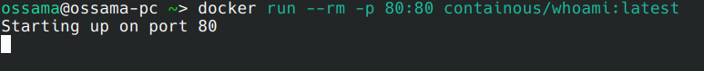
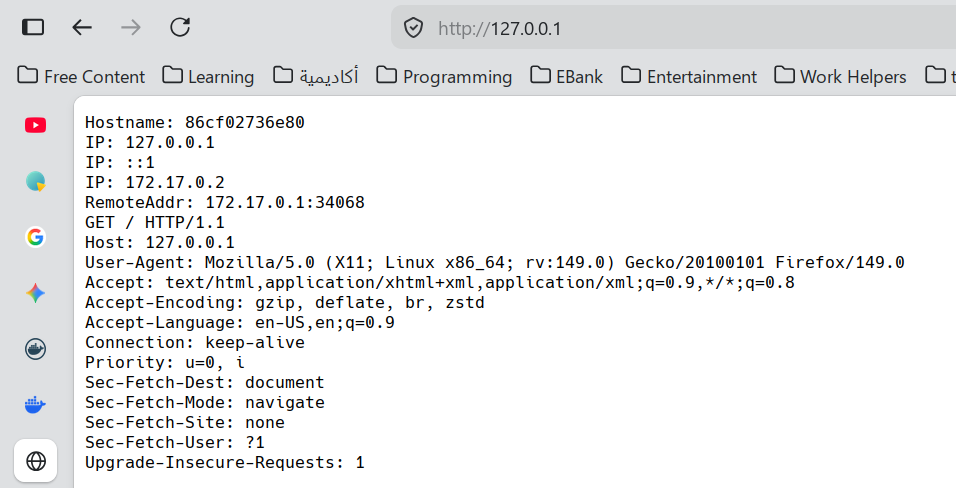
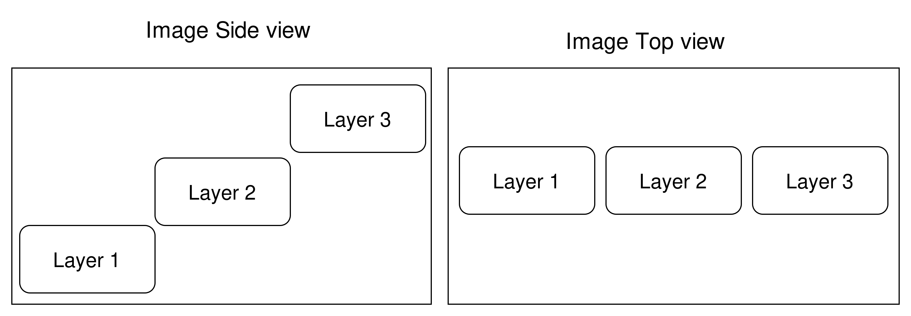
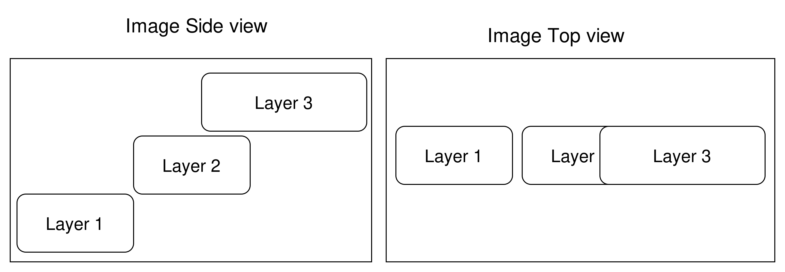

# Project Management
## Lecture 3
### Docker
**2025-2026**
---

```yaml
hideInToc: true
```
# Table of Content
<toc />

---

# What Is Docker
- Docker is system used to easily deploy application to production
- It is the answer to the age old question: "Why is not working?"
- How so ?
	- Docker allows to replicate the exact needed environment on the target machine without the hassle of installing the suitable OS, packages and libraries
	- It does so by ways of images and containers
	- At first it looks like virtual machines but it is lighter and different
	- VMs is about simulating hardware to create virtual environment that mimics real environment
	- Containers are about creating a sandbox environment in which changes don't propagate to the host OS without permission
	- This sandbox include:
		- Hardware
		- Filesystem
		- Network
---

# History of Docker
- Limiting apps to a certain sandbox is not new, UNIX did it in 1979 using troot, a tool that convinced a process it lived in its own world
- FreeBSD provided Jails in 2000 to do something similar
- Solaris Provided zones in 2004
- But the main problem is Linux
- Linux was climbing to the top of the server world
- As a result LXC (Linux Containers) was developed in 2008
- But it was complex and messy without a standard unit
---

```yaml
hideInToc: true
```
# History of Docker
## .Cloud
- .Cloud was platform as a service company, and it was having a nightmare handlingdeployment chaose  with causing a system crash
- Scripts was unrelaible and VMs where way to heavy
- As a result this company developed it own solution
- A tool that standardized the containers in LXC and started using it
- It was too good that other companies started asking .Cloud about the tool not the PAAS
- As a result .Cloud took a bald step forward and announced Docker as an opensource software at PyCon 2013
---

```yaml
hideInToc: true
```
# History of Docker
- As a result Docker became the core of cloud services
- You want to deploy you webapp and you need to make sure everything works correctly with little effort from the user's side? create an image containing everything you need in a single image (not file, image is made of layers) and poof bob's your uncle.
- Let's take Gitlab:
	- Gitlab is  a complex piece of software acting as:
		1. Git UI
		2. Issue Management
		3. CI/CD
		4. Package Repository
		5. Container (Image) Repository
---

```yaml
hideInToc: true
```
# History of Docker
- Let's take Gitlab:
	- Gitlab comes in 2 flavors community (free) and Enterprise (commercial)
	- You can download Gitlab and run it on bare metal but:
		- You need to install and configure PostgreSQL, Redis among other software
	- Or, hear me out, you pull the image from Docker Hub, write a few bytes of configuration and poof you have an instance running
	- All the configuration are built inside in the image and pre-done for your convenience
---

```yaml
hideInToc: true
```
# History of Docker
- Let's take Gitlab:
	- Instead of hours of configuration hell and mismatched versions of various software, we right the following docker compose file:
```yaml
services: 
  gitlab: 
    image: gitlab/gitlab-ce:latest 
    container_name: gitlab restart: always 
    hostname: 'domain' 
    environment: GITLAB_OMNIBUS_CONFIG: |
    external_url 'http://domain' 
    shm_size: '256m' 
    ports: 
      - '2424:22' 
    volumes: 
      - '/opt/gitlab/gitlab/config:/etc/gitlab' 
      - '/opt/gitlab/gitlab/logs:/var/log/gitlab' 
      - '/opt/gitlab/gitlab/data:/var/opt/gitlab' 
```
---

```yaml
hideInToc: true
```
# History of Docker
- This ease of use and opensource nature allowed Docker to grow and become the backbone of cloud services
- On October 20th 2025, half the Internet including Docker hub (the main repository for docker images) went offline
- The cause was bad DNS configuration in US-East-1 Amazon AWS services
- This crash, although lasted for few hours, indicated how crucial Docker is and how fragile the current Internet is too.
---

# The Components of Docker
## Docker Build
- It is a tool used to build Docker images using Dockerfile which contains the instruction of how to build the image and what command used to start it
## Docker Compose
- A tool used to create Docker container using a YAML (Yet Another Markup Language) file to describe the container (like the Gitlab one before)
- Together compose and build creates the Docker Engine
## Docker Networks
- Virtual networks that provides networking for containers connecting them to host and the outside world
## Docker Volumes
- A way to link a folder on the host OS to the Docker container allowing files to be persisted on the host, in case the container is deleted the data remains intact. Also provides a simple way to transfer files between the container and the OS in controlled and approved manner respecting permissions and security settings
---

```yaml
hideInToc: true
```

# The Components of Docker
## Image
- The basis of a Docker container. Represents a full application and its fully configured environment
## Container 
- The standard unit in which the application service resides and executes, in other words when we run an images it becomes a container
## Registry Service (Docker Hub or Docker Trusted Registry)
- Cloud or server based storage and distribution service for your images
---

# How to Use Docker
## Part 1: Installation
- The installation varies depending on your OS
- Linux:
	- Debian and Ubuntu will require adding a new repository containing the latest version of docker-ce
	- RHEL, Alma, Rocky and Fedora will have the latest version by default
	- Arch and it derivatives have the latest version of these packages
	- Be careful the name of the package might differ
- Windows
	- Unlike Linux, Docker doesn't run directly on Windows
	- You need to install either Hyper-V (VM manager) or WSL (Windows Subsystem For Linux, a Linux VM running on Windows)
- MacOS:
	- Honestly I am not that rich to try, but should work in similar manner to Linux
--- 

```yaml
hideInToc: true
```
# How to Use Docker
## Part 2: Permissions
- I will assume you are using Linux
- If running on VPS, then nothing needs changing
- If running on your machine, you either must add the current user to docker group using `sudo usermod -aG docker $USER` or run docker in rootless mode, the first option was more successful in my experience
	- You don't need to add the user to the `docker` group, however this simplifies your life and removes `sudo` from every Docker command you run
- One last thing, when installing Docker on Linux, by default it will not be running even if you restart the computer, to fix it run the following:
	- `sudo systemctl enable -f docker` this will enable the Docker service, so when restarting your PC the Docker starts with the system (this is required on VPS)
	- `sudo systemctl start/stop/restart docker` this will start/stop/restart the Docker service on command
--- 

```yaml
hideInToc: true
```
# How to Use Docker
## Part 3: The Test Container 
- We can use the simple `containous/whoami` image to test  if docker is running
- Let's take into consideration the commands
	- pull which downloads the image from Docker registry (by default Docker Hub unless specified)
	- run which creates a container from an existing image and runs it, if the images doesn't exists on your machine it will attempt to pull then creates the container, if the container creation is a success it will it, if  it fails throws and error message
- To pull we use: `docker pull containous/whoami` which will be default pull the latest version of the image, i.e. same as `docker pull containous/whoami:latest`, if we want to specify a certain version we change the text after the colon with the desired version like 
  `docker pull containous/whoami:v1.5.0`
---

```yaml
hideInToc: true
```
# How to Use Docker
## Part 3: The Test Container 
- Now we need to run the image by creating a container out of it, to do so we use the run command:
- `docker run --rm -p 80:80 containous/whoami:latest`
	- We specify the command run, as a result the engine will attempt to create a container using the image `containous/whoami:latest` or what ever version you desire
	- `--rm` means delete the container when finished, this makes the container a one time run, if you want the container to remain, simply remove `--rm`
	- `-p` tells us to like ports from the host to ports on the container, in our case `80:80` where the number before the colon (the first 80) refers to the host port and the number after the colon (the second 80) refers to the port on the container
--- 

```yaml
hideInToc: true
```
# How to Use Docker
## Part 3: The Test Container 
<div grid="~ cols-2 gap-4">
<div>

</div>
<div>

</div>
</div>
---

```yaml
hideInToc: true
```
# How to Use Docker
## Part 4: Managing Docker
- Image command (Not used directly means the command must be `docker image [cmd]`):
	- build: Build an image from a Dockerfile  (used directly `docker build`) 
	- history: Show the history of an image  
	- import:  Import the contents from a tarball to create a filesystem image   (used directly `docker import`)  
	- inspect: Display detailed information on one or more images  
	- load:  Load an image from a tar archive or STDIN  (used directly `docker load`)
	- ls: List images  
	- prune: Remove unused images  
	- pull: Download an image from a registry   (used directly `docker pull`)
	- push: Upload an image to a registry   (used directly `docker push`)
	- rm: Remove one or more images (to use directly we call `docker rmi`)
	- save: Save one or more images to a tar archive (streamed to STDOUT by default)  (used directly `docker save`)
	- tag: Create a tag TARGET_IMAGE that refers to SOURCE_IMAGE (used directly `docker tage`
--- 

```yaml
hideInToc: true
```
# How to Use Docker
## Part 5: Managing Containers
- Container command (Not used directly means the command must be `docker container [cmd]`):
	- attach: Attach local standard input, output, and error streams to a running container (can be used directly)
	-  commit: Create a new image from a container's changes (can be used directly)
	- cp: Copy files/folders between a container and the local filesystem (can be used directly)
	- create: Create a new container (can be used directly)
	- diff: Inspect changes to files or directories on a container's filesystem (can be used directly)
	- exec: Execute a command in a running container (can be used directly)
	- export: Export a container's filesystem as a tar archive (can be used directly)
	- inspect: Display detailed information on one or more containers (can be used directly)
	- kill: Kill one or more running containers-  (can be used directly)
	- logs: Fetch the logs of a container (can be used directly)
---

```yaml
hideInToc: true
```
# How to Use Docker
## Part 5: Managing Containers
- Container command (Not used directly means the command must be `docker container [cmd]`):
	-  ls: List containers (to use directly we type `docker ps`)
	- pause: Pause all processes within one or more containers  
	- port:  List port mappings or a specific mapping for the container  
	- prune: Remove all stopped containers  
	- rename:Rename a container  (can be used directly) 
	- restart: Restart one or more containers  (can be used directly) 
	- rm: Remove one or more containers  (can be used directly) 
	- run: Create and run a new container from an image  (can be used directly) 
	- start: Start one or more stopped containers  (can be used directly) 
	- stats: Display a live stream of container(s) resource usage statistics  (can be used directly)  
	- stop: Stop one or more running containers  (can be used directly)
---

```yaml
hideInToc: true
```
# How to Use Docker
## Part 5: Managing Containers
- Container command (Not used directly means the command must be `docker container [cmd]`):
	- top: Display the running processes of a container  (can be used directly) 
	- unpause: Unpause all processes within one or more containers  (can be used directly) 
	- update: Update configuration of one or more containers  (can be used directly)  
	- wait: Block until one or more containers stop, then print their exit codes (can be used directly)
---

# Building An Image
- We will build a simple image
	- It uses Apache web server to serve an index.html file
	- We use the following
```
FROM httpd:latest
COPY index.html /usr/local/apache2/htdocs/
```

- Let me explain:
	- The first line `FROM httpd:latest` means I am basing this image on Apache webserver image using the latest version
	- Think of it as inheritance, we get all the benefits of that image without the need to rebuild from zero
	- The second line copies the file `index.html` from the local directory to a folder inside the image `/usr/local/apache2/htdocs/` which were the webserver serves its pages
	- And this image is done, simple and easy
	- Not all images are like that
---

```yaml
hideInToc: true
```
# Building An Image
- This is a more complex image used to build a react frontend:
<div grid="~ cols-2 gap-4">
<div>

```
FROM node:24-trixie-slim AS base
ENV PNPM_HOME="/pnpm"
ENV PATH="$PNPM_HOME:$PATH"

RUN corepack enable

# Add missing shared libraries required by some native Node.js modules
RUN apt-get update
RUN apt-get upgrade -y
RUN apt-get install -y libc6 libstdc++6 libgomp1\
libprotobuf-dev openssh-client openssh-server
```
</div>
<div>

```
RUN rm -rf /var/apt/cache/*
RUN rm -rf /var/lib/apt/lists/*
WORKDIR /app

FROM base AS deps
COPY package.json pnpm-lock.yaml* ./
RUN CI="true" pnpm install

FROM deps AS build
COPY . .
# Generate so TypeScript has the types to build against
RUN CI="true" pnpm run build

FROM httpd:latest
COPY --from=build /app/dist  /usr/local/apache2/htdocs/
```
</div>
</div>
---

```yaml
hideInToc: true
```
# Building An Image
## Let me explain
- the line`FROM node:24-trixie-slim AS base` indicates we are using a NodeJS version 24 based on Debian Trixie image (there is also alpine, but it caused me some problems, Debian is more stabe) and we name this image base
- These lines:
```
ENV PNPM_HOME="/pnpm"
ENV PATH="$PNPM_HOME:$PATH"
RUN corepack enable
```

- Are used to indicates the settings for PNPM package manager and enabling it with corepack
- These lines
```
RUN apt-get update
RUN apt-get upgrade -y
RUN apt-get install -y libc6 libstdc++6 libgomp1\
libprotobuf-dev openssh-client openssh-server
```

- Are used to upgrade the packages inside the image to the latest version and install some extra needed ones
---

```yaml
hideInToc: true
```
# Building An Image
## Let me explain
- These lines
```
RUN rm -rf /var/apt/cache/*
RUN rm -rf /var/lib/apt/lists/*
```

- Are clean up to reduce image size
- This line `WORKDIR /app` sets the current working directory inside the image
- These lines
```
FROM base AS deps
COPY package.json pnpm-lock.yaml* ./
RUN CI="true" pnpm install
```

- Will allow us to inherit the base image (the NodeJS one) with a new image called `deps` then we copy `package.json` and `pnpm-lock.yaml*` files to the root dir (in our case `/app` because of `WORKDIR /app` command) the we install all the packages
---

```yaml
hideInToc: true
```
# Building An Image
## Let me explain
- These lines
```
FROM deps AS build
COPY . .
# Generate so TypeScript has the types to build against
RUN CI="true" pnpm run build
```

- Will allow us to again inherit the `deps` image with a new one called `build`, copy all the project files into the working dir and build the website
- And these lines provide the last part
```
FROM httpd:latest
COPY --from=build /app/dist  /usr/local/apache2/htdocs/
```

- Here we yet again create a new image but it copies the content of `/app/dist` to the serve folder inside Apache webserver image
- This is the final image
---

```yaml
hideInToc: true
```
# Building An Image
- What did there was an example for building an image and incorporating it with our system
- In order for any image to run it must have at the end the command `CMD` which is the `main` of the image (what to start when converting the image to container)
- The lack of `CMD` in the image means we are going to use the CMD of the parent image
- Assuming we want to use NodeJS to serve the built website instead of Apache webserver the final image would have looked like this
```
FROM node:24-trixie-slim
ENV PNPM_HOME="/pnpm"
ENV PATH="$PNPM_HOME:$PATH"
RUN corepack enable
RUN pnpm install http-server
COPY --from=build /app/dist /app
WORKDIR /app
CMD node http-server #or CMD ["node","http-server"]
```
---

# The Core of Docker
## Copy On Write
- To understand CoW we need to understand the structure of the image
- Docker images are immutable, meaning once created cannot be changed
- But, you say, what about runtime changes like when creating temporary files when running an image as container?
- Assuming we ran a database image as container (e.g. PSQL) then removed the container and recreated it, all the tables and the data we have created would have been deleted.
- And the container returns to the base form as described by the image
- But teacher, you ask, we can the images when we create our own.
- The answer is yes but actually no, you create a new layer

---

```yaml
hideInToc: true
```
# The Core of Docker
## Copy On Write
- Docker images are built using layers, every command in the Dockerfile like COPY or RUN can create a new layer (especially RUN)
- Layers are stacked on top of each other creating the final image
- When we look from the top we see a complete environment
- When we look from the side we see a set of layers filling the gaps between each other


---

```yaml
hideInToc: true
```
# The Core of Docker
## Copy On Write


- Each layer represents a change in the filesystem of the image
- That's good you say, but what if to layers change the same file/folder
---

```yaml
hideInToc: true
```
# The Core of Docker
## Copy On Write
- To which I answer, this is why we have CoW:

- As you can see here layer 3 changes some files that are changed in layer 2, as a result we only see the latest version of the files, meaning layer 3 version not layer 2
- However layer 2 is not changed and it contains the original version of the files
- Why? you ask, isn't this a waste of storage?
- To you I answer, my man, it is all about the storage
---

```yaml
hideInToc: true
```
# The Core of Docker
## Copy On Write
- You are not making a lick of sense tech, are sleep deprived?
- To which I answer yes I am sleep deprived, but it makes total sense when you incorporate re-usability of layers
- Each layer is hashed and stored, so when you download an new image or a newer of version the same image, and some of the new layers match an existing ones, we don't re-download
- That is CoW, we store only the change to the original state.
- But what about changes during container runtime, do they move to images?
	- As we said images are made out of layers, so every change even during runtime creates a new layer (editable at this time)
	- When we create a new container based on an image, we don't copy the image we reference it (think of it as git) and when we change we create a new layer containing the changes, this layer is container specific not image, meaning we don't change the image at all
---

# Docker Ultimate Weapon
## Docker Compose
- Dockerfile describes an image, and we use the command `docker build` to build that image
- we use the command `docker run` to run the container, but what if the container had a lot environment variables, ports and volumes? what do we do now , the command line would look ridiculous!
- My man, that's why we have docker compose
- A YAML file describing the container(s) of out application
---

```yaml
hideInToc: true
```
# Docker Ultimate Weapon
## Docker Compose
<div grid="~ cols-2 gap-4">
<div>

```yaml{|1|2|3|4|5|6-7|8-14|15-17|}
services:
  landing:
    container_name: landing
    image: $CI_REGISTRY_IMAGE:latest
    restart: always
    networks:
      - web 
    labels: 
      - 'traefik.enable=true' 
      - 'traefik.http.routers.landing.rule=Host(`${SITE_DOMAIN}`)' 
      - 'traefik.http.routers.landing.priority=1000' 
      - 'traefik.http.routers.landing.entrypoints=websecure' 
      - 'traefik.http.routers.landing.tls.certresolver=letsencrypt' 
      - 'traefik.http.services.landing.loadbalancer.server.port=80' 
networks:
  web:
    external: true
```
</div>
<div>

- <v-click at="1">We start with the word service</v-click>
- <v-click at="2">We give a indicator (like host name) for the container</v-click>
- <v-click at="3">We give a name for the container (Used to manage this container)</v-click>
- <v-click at="4">The base image (in this case it is an environment variable)</v-click>
- <v-click at="5">This indicates to restart the container automatically if it's shutdown</v-click>
- <v-click at="6">This container is connected to network called web</v-click>
- <v-click at="7">Coming soon (CI/CD)</v-click>
- <v-click at="8">We define the network web as an external network (not created by the docker compose)</v-click>
</div>
</div>
---

```yaml
hideInToc: true
```
# Docker Ultimate Weapon
## Docker Compose
<div grid="~ cols-2 gap-4">
<div>

```yaml
services:
  landing:
    container_name: landing
    image: $CI_REGISTRY_IMAGE:latest
    restart: always
    networks:
      - web 
    labels: 
      - 'traefik.enable=true' 
      - 'traefik.http.routers.landing.rule=Host(`${SITE_DOMAIN}`)' 
      - 'traefik.http.routers.landing.priority=1000' 
      - 'traefik.http.routers.landing.entrypoints=websecure' 
      - 'traefik.http.routers.landing.tls.certresolver=letsencrypt' 
      - 'traefik.http.services.landing.loadbalancer.server.port=80' 
networks:
  web:
    external: true
```
</div>
<div>

- The indicator is used as a host name when connecting to containers together (like backend and the database)
- To connect 2 containers together, they must be on the same network, a container can be on multiple networks
- Networks are managed either via docker compose file or `docker network` command
</div>
</div>
---

```yaml
hideInToc: true
```
# Docker Ultimate Weapon
## Docker Compose
### Docker Networks
- In docker the networks have one of the following types:

| Driver  | Description                                                         |
| ------- | ------------------------------------------------------------------- |
| bridge  | The default network driver.                                         |
| host    | Remove network isolation between the container and the Docker host. |
| none    | Completely isolate a container from the host and other containers.  |
| overlay | Swarm Overlay networks connect multiple Docker daemons together.    |
| ipvlan  | Connect containers to external VLANs.                               |
| macvlan | Containers appear as devices on the host's network.                 |

---

```yaml
hideInToc: true
```
# Docker Ultimate Weapon
## Docker Compose
### Docker Networks
- How to create a network? I will leave that to you to figure out, and I will ask about it in the next lecture
---

```yaml
hideInToc: true
```
# Docker Ultimate Weapon
## Docker Compose
### Volumes

<div grid="~ cols-2 gap-4">
<div>

```yaml{|5-6|7-8}
services: 
  db: 
    image: pgvector/pgvector:pg18-trixie 
    container_name: kc-db 
    environment: 
      POSTGRES_PASSWORD: H&*(hj0iosdfgwq 
    ports: 
      - 54321:5432  
    volumes: 
      - /opt/kc-db:/var/lib/postgresql 
```
</div>
<div>

- <v-click at="1"> A new `environment` allows us to pass environment vars to the container</v-click>
- <v-click at="2"> Allows us to map host ports (in out case 54321) to container port(5432) so we can connect to the database using localhost:54321, P.S. in order to use the port 5432 in the container the image Dockerfile must contain `EXPOSE 5432` otherwise it will not work</v-click>
</div>
</div>
---

```yaml
hideInToc: true
```
# Docker Ultimate Weapon
## Docker Compose
### Volumes

<div grid="~ cols-2 gap-4">
<div>

```yaml{|9-10|}
services: 
  db: 
    image: pgvector/pgvector:pg18-trixie 
    container_name: kc-db 
    environment: 
      POSTGRES_PASSWORD: H&*(hj0iosdfgwq 
    ports: 
      - 54321:5432  
    volumes: 
      - /opt/kc-db:/var/lib/postgresql 
```
</div>
<div>

- <v-click at="1">Here we are mapping (mounting in docker term) the path `/opt/kc-db` on the host to `/var/lib/postgresql` in the container, so any change on that folder in the container is visible on the host and vice versa. if we want we can attach `:ro` at the end to make this volume read only, meaning the container cannot change it</v-click>
</div>
</div>
---

# Is This All?
- No, it is not.
- We still have a lot to do with docker
- What is this `label` thing, and what the heck `Traefik`
- Do we need to manage everything using CLI or is there some kind of UI
- Can we build a stack using docker only?
## We will discuss all those point when doing CI/CD next week

