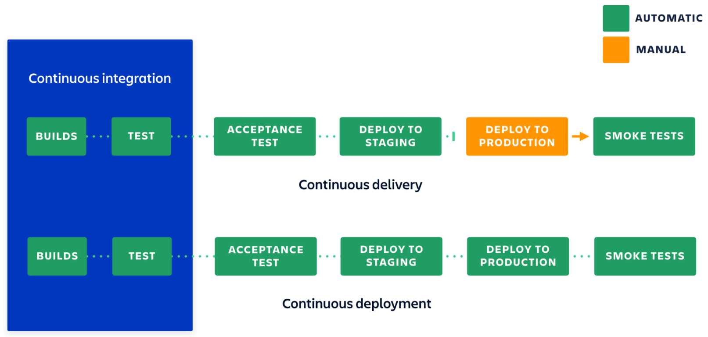
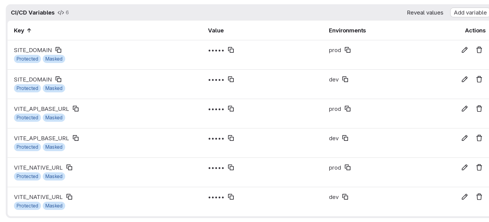

# Project Management
## Lecture 4
### DevOps
**2025-2026**
---

```yaml
hideInToc: true
```
# Table of Content
<toc />

---

# What is DevOps?
- A set of practices, tools, and a work culture that automates and integrates processes between software development and IT teams.
- It focuses on:
	- Team empowerment
	- Team communication and collaboration
	- Process automation 
- For many organizations, we can define the following common goals of DevOps.
	- Deployment frequency 
	- Faster time to market
	- Lower failure rates 
	- Shorter lead times
	- Improved recovery time
---

## Goals of DevOps
- Deployment frequency :
	- Improving the frequency at which you release or deploy software in your organization is often a key driver of the adoption of DevOps. 
	- This requires changing the way the collaboration and communication within the organization to deliver value to the end users.
	- When developers and operations teams start focusing on the same shared goals, they start working together more effectively and deliver better value.
- Faster time to market 
	- Most organizations will compete with another for the services they provide. Having a faster time to market gives the organization a competitive edge over its competitors. With DevOps, you can work to increase value by reducing the amount of time it takes from idea inception to product release. 
	- As a business, the longer it takes to release a product, the more money the business loses to its competitors
--- 

```yaml
hideInToc: true
```
## Goals of DevOps
- Lower failure rates
	- Every organization has failures, but with DevOps, you can, over time, expect to realize lower failure rates through teams collaborating with each other and communicating better with each other.
	- DevOps gives teams the ability to work more closely and communicate more effectively. In mature organizations, it allows for cross-functional teams. The shared knowledge between these teams and the individuals within them and the greater understanding of each other's roles leads to lower failure rates.
- Shorter Lead Time
	- Lead time is the amount of time between the initiation and completion of a specific task. In DevOps, this would be the amount of time between work starting on a user story and that story making it to release. 
	- Tied hand in hand with faster time to market, shorter lead times is not just about your product but everything in the whole life cycle. This could be anything from planning where you capture requirements more effectively all the way to building infrastructure quicker than before.
--- 

```yaml
hideInToc: true
```
## Goals of DevOps
- Improved Recovery Time
	- Most organizations have Service-Level Agreements (SLAs) to measure the performance of key service-based metrics such as availability. 
	- However, how many organizations can tell you, on average, how long it takes to recover a service? Not many.  
	- Having the level of collaboration that lets you discuss the reasons behind failures, understand them, and implement steps to prevent them from happening again is a sign of a mature organization.
	- An organization that measures this metrics and takes steps to reduce them is an even more mature organization.
---

# How DevOps Work?
- DevOps requires **continuation** to do its work 
- Continuation is described as the ability to do the thing continuously time over time
- In DevOps we focus on:
	- Continuous Integration
	- Continuous Delivery
	- Continuous Deployment
---

## Continuous Integration
- Continuous integration (CI) is the practice of quickly integrating newly developed code with the rest of the application code to be released. This saves time when the application is ready to be released. This process is usually automated and produces a build artifact at the end of the process.
- The process of CI contains a number of steps, and these are critical to achieving CI, which is meaningful and efficient. Automated testing is the first step toward CI. Four main types of tests exist that can be automated as part of CI.
- These tests are as follows:
	- Unit tests: Tests that are narrow in their scope. They usually focus on a specific part  of code, such as a function, and is used to test the behavior of a given set of parameters.
	- Integration tests: Ensures that different components work together. This can involve several parts of your application, as well as other services.
	- Acceptance tests: In many ways, this is similar to integration tests. The big  difference is that acceptance tests focus on the business case.
	- User interface tests: Tests that focus on how the application performs from a user's  perspective.
--- 

```yaml
hideInToc: true
```
## Continuous Integration
- When you integrate early and often, you reduce the scope of changes, which, in turn, makes it easier to identify and understand conflicts when they occur. Another big advantage of this approach is that sharing knowledge is easier as the changes are more digestible than big bang sets of code changes.
- Another note is that if the main branch becomes broken by a commit in code, then the number one priority is fixing it. The more changes that are made to the build while it's broken, the harder it will become to understand what has broken it.
- Every new piece of work that you implement should have its own set of tests. It's important to get into this habit of writing granular tests and aiming for a level of code coverage, as this gives you a comfortable level of knowledge that you are testing the functionality of your application sufficiently.
- The value of CI is realized when the team makes changes on a frequent basis. It's important to make sure that your team integrate these changes daily. Integrating often, as you may recall, is key to making sure we can easily identify what is broken.
--- 

## Continuous delivery 
- Continuous delivery (CD) is an approach where teams release products frequently and with high quality, and with a level of predictability from source code repositories through to a production environment using automation. It builds on the work that's done in CI to take the build artifact and then deliver that build to a production environment. 
- CD is, in fact, a collection of best practices associated with Agile. It focuses your organizations on developing a highly streamlined and automated software release process. At the core of the process is an interactive feedback loop.
- This feedback loop, sometimes referred to as continuous feedback, centers around delivering software to the end users as quickly as possible, learning from experience, and then taking that feedback and incorporating it into the next release.
--- 

```yaml
hideInToc: true
```
## Continuous delivery 
- CD is a separate process to CI, but they chain off each other and in mature organizations, they are used together. This means that on top of the work you have done in CI to attain levels of automated testing, you can now automatically deploy all those changes after the build stage. 
- With CD, you can decide on a schedule that best suits your organization, whether that's daily, weekly, or monthly – whatever your requirements may be. If you want to get the true benefits of CD, then deploy to production as soon as possible to make sure that you release small batches that are easy to solve in case of problems that may arise.
--- 

## Continuous deployment 
- Continuous deployment is one step beyond continuous delivery. Every change that passes through all the stages of your production pipeline is released to your customers. There is no human intervention – a failed test, at this stage, will prevent new releases to production.
- Continuous deployment is a great way to speed up the feedback loop and take the pressure off as there is no release day. Developers are then able to focus on building high quality software while seeing their work go live minutes after they've finished working on it. Continuous integration is part of both continuous delivery and continuous deployment.

---

# Build System
- To correctly take full advantage of CI/CD we need to use build system
- Build systems are an application or set of application used to automate the building and testing (specifically unit testing) process during software development
	- Maven and Gradle for Java
	- NPM,PNPM or YARN + scripts for NodeJS
- What does build system does?
	- Manage dependencies
	- Build final packages
	- Perform testing (up to integration testing)
---

## Dependency Management
<div grid="~ cols-2 gap-4">
<div>

- No application is built from zero
- We need to use external libraries to speed up the process
- But these libraries might have dependencies of their own
	- We need to download their dependencies and the dependencies of their dependencies and so on and so forth
	- This will get complicated quickly, specifically with versions, what if 2 different libraries use 2 different versions of the same library
	- What if I want to use these libraries in other project, Do I need to re-download them?
	- As you can see this will get out of quickly get out of hand
</div>
<div>

</div>
</div>
---

```yaml
hideInToc: true
```
## Dependency Management
- Using dependency management will remove all those problems from the developer hand and shift them to the BS.
- Side note:
	- Maven uses XML files to describe the building process
	- Gradle compile Kotlin or Groovy scripts to create the build process
	- NPM/PNPM/YARN uses package.json file (with other configuration files) to build the application using scripts
--- 

```yaml
hideInToc: true
```
## Dependency Management
- In Maven we add a dependency to dependencies sections
```xml
<dependencies>
 <dependency>
    <groupId>me.paulschwarz</groupId>
    <artifactId>spring-dotenv</artifactId>
    <version>5.1.0</version>
    <scope>compile</scope>
</dependency>
</dependencies>
```
- In Gradle we declare dependency
```groovy
dependencies {
    implementation 'org.codehaus.groovy:groovy:3.0.5'
}
```
- In NodeJS we add a line in `package.json`
```json
  "dependencies": {
    "@emotion/react": "^11.14.0"
    }
```
---

```yaml
hideInToc: true
```
## Dependency Management
- We can also specify when the dependency is used
- In Maven we can say the dependency is used during code writing, compiling or testing
```xml
<dependencies>
 <dependency>
    <groupId>me.paulschwarz</groupId>
    <artifactId>spring-dotenv</artifactId>
    <version>5.1.0</version>
    <!--This is when we use the library, remove it and the library is used during code, use test to use this library in testing phase only-->
    <scope>compile</scope>
    
</dependency>
</dependencies>
```
	
- Same thing in Gradle
```groovy
dependencies {
    testImplementation 'org.codehaus.groovy:groovy:3.0.5'
}
```
---

```yaml
hideInToc: true
```
## Dependency Management
- In NodeJS we can specify where the dependency is used, during runtime or development time
- Thats why sometimes we install a package with -D/d flag
- This will install the library in devDependencies which is used during development but when we do the build of the final application it will be not used
---

## Package Generation
- Another task of build system is to generate the packaging of the application
- If we are writing a desktop application we might need the build system to generate everything up to and including `setup.exe`
- In Maven and Gradle this can be done through the use of plugins
- In NodeJS we need to write custom scripts
- Side Note:
	- To create a `setup.exe` for your application you can use `InnoSetup`a tool that uses a script to compile an installation file for your application
- When developing android applications we either generate `APK` or `ABB` (The later for the deployment on Google's Playstore)
- And sometimes we compile and build a docker image (finally, connecting to the previous lecture)
---

```yaml
hideInToc: true
```
## Package Generation
- Generally Maven and Gradle will generate `JAR` for Java applications
- NodeJS will generate a `dist` or `output` folder containing the final result
---

# Gitlab & Github
- Similar to each other, both use git as backbone with support for Issue management and tracking, user control, package management, CI/CD (DevOps)
- They do support DevOps through the use of special files:
	- `.gitlab-ci.yml` in Gitlab
	- `.github/workflow/*.yml` in Github
---

## Gitlab
- Let's take Gitlab
<div grid="~ cols-3 gap-1">
<div>

```yaml
stages:
  - build 
  - deploy 

variables: 
  DOCKER_DRIVER: overlay2 
  DOCKER_TLS_CERTDIR: "" 
  IMAGE_TAG: $CI_PIPELINE_IID 

build-production: 
  stage: build 
  image: docker:latest 
  needs: []  
  only: 
    - main  
  tags: 
    - Main  
```
</div>
<div>

```yaml
  before_script: 
    - docker login -u
"$CI_REGISTRY_USER"
-p "$CI_REGISTRY_PASSWORD" "$CI_REGISTRY" 
  script:
    - echo $CI_REGISTRY  
    - echo $CI_REGISTRY_IMAGE 
    - docker build --no-cache
-t $CI_REGISTRY_IMAGE:$IMAGE_TAG
-t $CI_REGISTRY_IMAGE:latest . 
    - docker push
$CI_REGISTRY_IMAGE:$IMAGE_TAG 
    - docker push $CI_REGISTRY_IMAGE:latest 

deploy-production:
  stage: deploy
  image: docker:latest
  needs: []
  only:
    - main
  tags: 
    - Main 
```
</div>
<div>
```yaml
  before_script:
    - docker login -u
"$CI_REGISTRY_USER" -p "$CI_REGISTRY_PASSWORD"
"$CI_REGISTRY"
  script:
    - docker compose -f
docker-compose.yml pull --policy always
    - docker compose -f
docker-compose.yml up -d

```
</div>
</div>
---

```yaml
hideInToc: true
```
# Gitlab
- That was a simple file, it builds and deploys a docker image to the same server the Gitlab instance is running on
<div grid="~ cols-2 gap-1">
<div>

```yaml{|1-3|5-8|9-17}
stages:
  - build 
  - deploy 

variables: 
  DOCKER_DRIVER: overlay2 
  DOCKER_TLS_CERTDIR: "" 
  IMAGE_TAG: $CI_PIPELINE_IID 

build-production: 
  stage: build 
  image: docker:latest 
  needs: []  
  only: 
    - main  
  tags: 
    - Main  
```
</div>
<div>

- <v-click at="1">What are the stages of this build</v-click>
-  <v-click at="2">Some environment variables to set during build time</v-click>
- <v-click at="3">We define our first operation which will execute during the build stage using the latest docker image called `docker` and needs no one, operates only on branch main and uses the `Main` runner. The Runner is a gitlab software that runs the yaml files, follows the instructions and produces the results
  </v-click>
</div>
</div>
---

```yaml
hideInToc: true
```
# Gitlab
- That was a simple file, it builds and deploys a docker image to the same server the Gitlab instance is running on
<div grid="~ cols-2 gap-1">
<div>

```yaml{|1|2-4|5|8-10|11-13|}
before_script: 
    - docker login -u
"$CI_REGISTRY_USER"
-p "$CI_REGISTRY_PASSWORD" "$CI_REGISTRY" 
  script:
    - echo $CI_REGISTRY  
    - echo $CI_REGISTRY_IMAGE 
    - docker build --no-cache
-t $CI_REGISTRY_IMAGE:$IMAGE_TAG
-t $CI_REGISTRY_IMAGE:latest . 
    - docker push
$CI_REGISTRY_IMAGE:$IMAGE_TAG 
    - docker push $CI_REGISTRY_IMAGE:latest 
```
</div>
<div>

- <v-click at="1">Some things to execute before the main script</v-click>
	- <v-click at="2">Log in to the docker registry of the my GitLab instance (You can log in to DockerHub here)</v-click>
-  <v-click at="3">The script to execute</v-click>
	- <v-click at="4">Build the docker image and attach 2 tags to it</v-click>
	- <v-click at="5">Push each tag to the logged in registry</v-click>
</div>
</div>
This concludes the build stage

---

```yaml
hideInToc: true
```
# Gitlab
- That was a simple file, it builds and deploys a docker image to the same server the Gitlab instance is running on
<div grid="~ cols-2 gap-1">
<div>

```yaml{|1|2-8|9-12|14-15|16-17|}
deploy-production: 
  stage: deploy 
  image: docker:latest 
  needs: [] 
  only: 
    - main 
  tags: 
    - Main  
  before_script: 
    - docker login -u 
"$CI_REGISTRY_USER" -p "$CI_REGISTRY_PASSWORD" 
"$CI_REGISTRY" 
  script: 
    - docker compose -f 
docker-compose.yml pull --policy always 
    - docker compose -f 
docker-compose.yml up -d 
```
</div>
<div>

- <v-click at="1">We now start a new job called deploy production during the stage deploy</v-click>
- <v-click at="2">Same as before</v-click>
- <v-click at="3">Same as before</v-click>
- <v-click at="4">We use the docker compose file in the repository to always pull the latest images to the OS containing the Gitlab instance</v-click>
- <v-click at="5">We Start the docker compose and run the container</v-click>
</div>

</div>
---

```yaml
hideInToc: true
```
# Gitlab
- But what if I want to deploy to another server? well, you need learn SSH
- Secure Shell is a way to send files and commands and control remote servers
- To login to remote server we use `ssh <user>@<server>` using
	-  username & password
	- Public Key & Private Key
		- This method is mostly used with CI/CD as it safer
		- We generate a pair of private/public keys using `ssh-keygen`
		- The private key goes to gitlab
		- The public key gets added to `authorized_keys` file in `/home/<user>/.ssh` folder on the server (in case we are using root user, we use `/root/.ssh/` folder)
---

```yaml
hideInToc: true
```
# Gitlab
- Wait a minute, where do I place the private key on Gitlab?
- Easy, Ci/CD Variables.
	- In Gitlab repository/group management there is a settings section containing CI/CD variables
	- A set of environment variables that are inject by Gitlab into the context of CI/CD exection for the sole purpose of using them inside the context without exposing them to external developers
		- For example, if have an OSS library being published to Maven Central (Main repository for Java & Kotlin libraries) we need to sign this library using PGP signature
		- This used private/public key, we sign using the private, which by name must not given to the outside world
		- We store it inside the CI/CD variables under the name PRIVKEY for example
		- When executing the CI/CD the variable PRIVVKEY will be injected into the context and used only and only in the context
---

```yaml
hideInToc: true
```
# Gitlab
- An example snippt
```yaml
  before_script: 
    - apk add --no-cache openssh 
    - eval $(ssh-agent -s) 
    - mkdir -p ~/.ssh/ 
    - echo "${TICKET963_KEY}" | ssh-add - 
    - echo "StrictHostKeyChecking no" >> ~/.ssh/config 
    - echo SITE_DOMAIN=${SITE_DOMAIN} >> .env 
    - echo CI_REGISTRY_IMAGE=${CI_REGISTRY_IMAGE} >> .env 
    - echo IMG_TAG=latest >> .env 
  script: 
    - scp docker-compose.yml root@ticket963.com:/root/ 
    - scp .env root@ticket963.com:/root/ 
    - ssh root@ticket963.com "docker login -u \"${CI_REGISTRY_USER}\"
-p \"${CI_REGISTRY_PASSWORD}\" \"${CI_REGISTRY}\"
&& docker compose -f docker-compose.yml pull --policy always
&& docker compose -f docker-compose.yml up -d" 
    - ssh root@ticket963.com "rm docker-compose.yml .env" 
```
---

```yaml
hideInToc: true
```
# Gitlab
- When using CI/CD variables, we can use environments
- Let's say I have 2 servers
	- Development
	- Production
- When I push to `dev` branch I publish to Development server
- When I push to `main` branch I publish to Production server
- They use the same variables, but for security reasons the values change between production and development
---

```yaml
hideInToc: true
```
# Gitlab

---

```yaml
hideInToc: true
```
# Gitlab
- This will allow us to create 2 more jobs:
	- build-dev
	- deploy-dev
- But teach, how can we till Gitlab to truly tell which job on which branch and which enviorment
- It's super easy barley an inconvenience
<div grid="~ cols-2 gap-1">
<div>

```yaml
deploy-dev: 
  stage: deploy 
  image: docker:latest 
  needs: 
    - job: build-dev 
  only: 
    - dev 
  tags: 
    - Main 
  environment: 
    name: dev 
```
</div>
<div>

```yaml
deploy-prod: 
  stage: deploy 
  image: docker:latest 
  needs: 
    - job: build-prod 
  only: 
    - main 
  tags: 
    - Main 
  environment: 
    name: prod 
```
</div>
</div>
---

# Final Long Thoughts
- We mostly develop web apps
- We mostly deploy to shared hosting using PHP
- Here we can use the provided FTP instead of SSH 
- This can actually be used with NodeJS sometimes
- But if we have our own VPS/Dedicated server, we might take a different approach
- We use a reverse proxy server like Apache or Nginx to route the traffic  to various services we have, but even though they are fast and widely used, their configuration is a nightmare and complex
- Let's say we use deploy our apps as docker containers on our server, having to track each port of each container to link to is demanding
- Let's use Traefik
---

```yaml
hideInToc: true
```
# Final Long Thoughts
## Traefik
<div grid="~ cols-2 gap-4">
<div>

- Traefik is reverse proxy server to the docker era
- It's super easy barley an inconvenience to setup
- It requires some configuration to tell it to listen ports on the host, mostly 80 (http) and 443 (https)
- Then it routes automagically the traffic to the correct containers based mostly URL
- Remember the labels thingy?
</div>
<div>

```yaml
services:
  landing:
    container_name: landing
    image: $CI_REGISTRY_IMAGE:latest
    restart: always
    networks:
      - web 
    labels: 
      - 'traefik.enable=true' 
      - 'traefik.http.routers.landing.rule=Host(`${SITE_DOMAIN}`)' 
      - 'traefik.http.routers.landing.priority=1000' 
      - 'traefik.http.routers.landing.entrypoints=websecure' 
      - 'traefik.http.routers.landing.tls.certresolver=letsencrypt' 
      - 'traefik.http.services.landing.loadbalancer.server.port=80' 
networks:
  web:
    external: true
```
</div>
</div>
---

```yaml
hideInToc: true
```
# Final Long Thoughts
## Traefik
<div grid="~ cols-2 gap-4">
<div>

- <v-click at="1">Enable Traefik for this container</v-click>
- <v-click at="2">Use the value inside environment variable `SITE_DOMAIN` base URL</v-click>
- <v-click at="3">Set the priority (If more than one container use the same URL,requires a bit more complex setup)</v-click>
- <v-click at="4">Using a point called websecure (in our Traefik config, this one used for https)</v-click>
- <v-click at="5">Using a certificate reslover for HTTPS certificate called letsencrypt (in our configuration this uses the free Let's Encrypt services for create certificates for our domian)</v-click>
- <v-click at="6">Connect to port 80 on the container (this might differ)</v-click>
- <v-click at="7">Enable Traefik for this container</v-click>
</div>
<div>

```yaml{|9|10|11|12|13|14|}
services: 
  landing: 
    container_name: landing 
    image: $CI_REGISTRY_IMAGE:latest 
    restart: always 
    networks: 
      - web 
    labels: 
      - 'traefik.enable=true'  
      - 'traefik.http.routers.landing.rule=Host(`${SITE_DOMAIN}`)'  
      - 'traefik.http.routers.landing.priority=1000'  
      - 'traefik.http.routers.landing.entrypoints=websecure'  
      - 'traefik.http.routers.landing.tls.certresolver=letsencrypt'  
      - 'traefik.http.services.landing.loadbalancer.server.port=80'  
networks: 
  web: 
    external: true 
```
</div>
</div>
---


```yaml
hideInToc: true
```
# Final Final Long Thoughts
- There is more to Traefik than just the simple configuration provided previously
- Also I need  a tool to allow me to manage containers and images without using CLI, this is Portainer
- I need to monitor my system and read the logs of my containers
	- This is Graffana, which is a system monitoring tool
		- It has its own system of plugins to like Prometheus for monitoring the host system and Promtail with Loki for log management
- (Repository link will be provided here containing a valid configuration for these software)
---

```yaml
hideInToc: true
```
# Final Final Final Thoughts, Swear to God Cross My Heart Hope to Die
- What about Github?
- Will the syntax is different, it's similar in many ways and follows the same logic
- This repository contains the workflow for publishing the lectures of this course
https://github.com/OssNass/Project-Management
- Take a look it
- I found out that AI is really good at CI/CD stuff, so use it especially Google's Gemini 