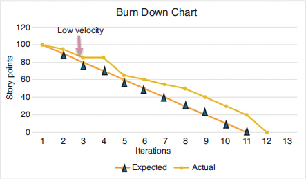
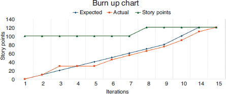

# Project Management

## Lecture 5

### Agile Fundamentals

Dr. Ossama Nasser
2025-2026

---

```yaml
hideInToc: true
```

# Table of Contents

<Toc minDepth="1" maxDepth="2" />

---

# Definition

* Agile methodology

  * Refers to a set of ideas that include several complete methods such as:

    * Extreme Programming (XP)
    * Scrum
    * Lean Software
    * Crystal
  * Applied as subsets or combinations
  * Many developers adopt some ideas without fully adopting a complete method

---

```yaml
hideInToc: true
```

# Definition

## Agile Manifesto

* The Agile Manifesto includes the following 12 principles:

  1. Our highest priority is to satisfy the customer through early and continuous delivery of valuable software
  2. Welcome changing requirements, even late in development. Agile processes harness change for the customer's competitive advantage
  3. Deliver working software frequently, from a couple of weeks to a couple of months, with a preference for shorter timescales
  4. Business people and developers must work together daily throughout the project
  5. Build projects around motivated individuals. Give them the environment and support they need, and trust them to get the job done
  6. The most efficient and effective method of conveying information to a development team is face-to-face conversation
  7. Working software is the primary measure of progress

---

```yaml
hideInToc: true
```

# Definition

## Agile Manifesto

* The Agile Manifesto includes the following 12 principles:

  8. Agile processes promote sustainable development. Sponsors, developers, and users should be able to maintain a constant pace indefinitely
  9. Continuous attention to technical excellence and good design enhances agility
  10. Simplicity—the art of maximizing the amount of work not done—is essential
  11. The best architectures, requirements, and designs emerge from self-organizing teams
  12. At regular intervals, the team reflects on how to become more effective, then tunes and adjusts its behavior accordingly

---

```yaml
hideInToc: true
```

# Definition

## Agile Manifesto

* These principles can be reorganized as follows:

  * **Organizational**

    1. Focus on the customer
    2. Allow the team to self-organize
    3. Work at a sustainable pace
    4. Develop the minimum viable program:

       1. Minimum set of features
       2. Build only what is required
       3. Develop code and tests
    5. Accept change

---

```yaml
hideInToc: true
```

# Definition

## Agile Manifesto

* These principles can be reorganized as follows:

  * **Technical**

    1. Develop iteratively

       1. Produce repeated development cycles
       2. Freeze functional requirements during each cycle
    2. Treat testing as a core resource

       1. Do not start a new cycle until all tests pass
       2. Test first
    3. Express requirements using scenarios

---

```yaml
hideInToc: true
```

# Definition

## Agile Manifesto

* Organizational principles

  * Agile focuses on the customer. The goal of software development is to deliver the best return on investment for the customer; customer representatives should be involved throughout the project
  * Agile teams are self-organizing and assign tasks themselves, reducing managerial responsibilities significantly
  * Agile promotes sustainable pace by rejecting "death marches"

    * Periods of extreme pressure forcing teams to work excessively toward deadlines
    * Sustainability requires reasonable working hours, preserving evenings and weekends

---

```yaml
hideInToc: true
```

# Definition

## Agile Manifesto

* Organizational principles

  * Agile development is simple in three aspects:

    * Build only core functionality (minimum features)
    * Build only what is required without unnecessary future-proofing (minimum product)
    * Build only code and tests, excluding anything not delivered to the client (minimal waste)
  * Agile embraces change. Requirements cannot be fully defined at the beginning; they evolve as users interact with intermediate releases

---

```yaml
hideInToc: true
```

# Definition

## Agile Manifesto

* Technical principles

  * Agile development is iterative, consisting of successive iterations
    Each iteration is relatively short (a few weeks) and produces a working version of the software, even if partial, allowing customer feedback for the next iteration
  * Scrum introduced the rule of freezing functional requirements during iterations; new ideas are postponed to the next iteration

---

```yaml
hideInToc: true
```

# Definition

## Agile Manifesto

* Technical principles

  * Testing priority reflects the focus on quality:

    * No new development starts until all existing tests pass
    * Test-first principle (introduced with XP): no code is written before tests

---

```yaml
hideInToc: true
```

# Definition

## Agile Manifesto

* Technical principles

  * Use scenarios to define functionality

    * A scenario describes a specific interaction between user and system
    * Example: a phone call from dialing to disconnect
    * Similar to use cases or user stories

---

# Roles in Agile

* Team
	* A self-organizing group of developers and others (e.g., customer representatives) responsible for continuously assigning tasks
* Product Owner
	* Responsible for defining product features and requirements, which can change outside a Sprint
* Scrum Master
	* Manager, coach, and mentor; cannot be the Product Owner
* Agile emphasizes integrating the customer into the team rather than relying on contract negotiation

---

# Agile Practices

<div grid="~ cols-2 gap-4">
<div>

* Organizational

  * Daily meetings
  * Planning
  * Continuous Integration
  * Retrospective
  * Collective code ownership

</div>
<div>

* Technical

  * Test-driven development
  * Refactoring
  * Pair Programming
  * Simplest solution
  * Coding standards

</div>
</div>

---

```yaml
hideInToc: true
```

# Agile Practices

## Organizational

* Daily meetings
	* Agile promotes direct communication
	- Scrum uses a Daily Scrum meeting
	* Duration: ~15 minutes
	* Purpose: review completed and upcoming tasks
-  Planning
	* Software projects struggle with estimation
	* Agile proposes Planning Game (XP) and Planning Poker (Scrum)
	* Both rely on group estimation and consensus

---

```yaml
hideInToc: true
```

# Agile Practices

## Organizational

* Retrospective

  * Team pauses development to reflect and improve processes
* Collective Code Ownership

  * All team members are responsible for all code
  * Prevents dependency on individuals and improves collaboration

---

```yaml
hideInToc: true
```

# Agile Practices

## Technical

**Test-Driven Development (TDD)**

- Transforms the “test-first” principle into a mandatory practice.
- When applied iteratively, this practice consists of:
	- Writing a test that corresponds to a new functionality
	- Running the program, which is expected to fail the test since the functionality is new
	- Fixing the program, running it again, and continuing to fix it until it passes the test (and all other tests, to prevent regression)
- Reviewing the code and refactoring it to ensure design consistency. This sequence of steps—applied from the very beginning (when the program is empty and will fail even the simplest test) and repeated throughout the development cycle—is the fundamental form of software development in XP.

---

```yaml
hideInToc: true
```

# Agile Practices

## Technical
**Refactoring**
- It is the process of examining the design or investigating it and applying any necessary transformations to improve its consistency.
- There are catalogs of refactoring transformations, including typical examples in object-oriented programming, such as moving a feature (field or method) up or down the inheritance hierarchy.
- Refactoring is essential for test-driven development:
	- A process that only adds a piece of code for each new test will lead to poorly structured and ad-hoc programs
	- Refactoring is necessary to maintain a clean design
	- Just as scenarios and tests are Agile’s answer to heavy upfront requirements planning, refactoring is Agile’s answer to heavy upfront design

---

```yaml
hideInToc: true
```
# Agile Practices

## Technical

- **Pair Programming**
	- An XP practice where two programmers work together: one writes the code while the other reviews it
	- A related technique is the _Rubber Duck_ method:
		- It involves explaining the code to an object (usually a small rubber duck); during the explanation, the programmer often discovers their own mistakes
- **Simplest Possible Solution**
	- XP popularized the practice of implementing the simplest possible solution
	- In line with the principle of “build only what is required,” it avoids extra work aimed at making the solution more scalable or reusable, as often recommended by traditional software engineering (especially object-oriented design principles)
	- Such work is often speculative, since we may not need reuse and cannot predict future directions of system expansion
---

```yaml
hideInToc: true
```
# Agile Practices

## Technical
- **Coding Standards**
	- Agile encourages writing code according to defined standards: a set of style rules that the team applies to all produced code
	- As a result **check style tools** became widely used in the industry
		- They are used to enforce styles like:
			- How to name variables, functions and classes
			- Using camel case (upper case per word) or snake case (separate words using `_`)
			- How to organize files in the folder
			- and more		
---

# Sprint

- One of the core principles of Agile is working iteratively and delivering frequent increments.
- All Agile methodologies apply this idea, with varying durations for individual iterations.
- The term _Sprint_ (from Scrum) is commonly used to refer to this concept.
- The purpose of a Sprint is to achieve significant project progress by working from a task list, known in Scrum as the _Sprint Backlog_. In most Agile methodologies, each task in this list is defined as the implementation of a “user story.”

---

```yaml
hideInToc: true
```

# Sprint

## Basics

* Typically lasts about one month (according to Scrum)
* Task list must not grow during Sprint
	* Any new tasks are added to later sprints, meaning the current sprint will not grow in tasks

## Closed Window Rule

* No new tasks added during Sprint
* Known as feature freeze
* Prevents scope changes during development

---

# Agile Tools

<div grid="~ cols-2 gap-4">
<div>

* Code
* Tests
* User Stories
* Story Points
* Velocity
* Pair Programming

</div>
<div>

* Backlog
* Burndown and Burnup Charts

</div>
</div>

---

```yaml
hideInToc: true
```

# Agile Tools

## Code
- Code lies at the heart of Agile, specifically executable code that can run as part of the system under development.
- The focus on code reflects Agile’s effort to shift the discussion in software engineering from processes and plans to tangible results that are more critical to the success of any software project.
## Tests
- In addition to code, tests are considered a primary product supported by all Agile methodologies.
- XP (Extreme Programming) was the methodology that re-established testing as a fundamental concept in software engineering.
- There are two types of tools involved in this context (the second type consists of a collection of instances of the first): Unit Tests and Regression Test Suites.

---

```yaml
hideInToc: true
```

# Agile Tools

## Tests
**Unit Test**
- It is a description of executing a specific test along with its expected results.
- It includes:
	- The function or method being tested
	- Setup and teardown methods executed before the test to prepare the environment, and after the test to clean up any changes to the system
	- Assertion, which expresses the condition for the test to pass

---

```yaml
hideInToc: true
```

# Agile Tools

## Tests

* Unit Test

```java
public class TestExample{
@Before
void before(){this.file=new File('some file');}
@Test
void existsTest(){assert this.file.exists()}
@After
void after(){this.file.close();}}
```

---

```yaml
hideInToc: true
```

# Agile Tools

## Tests

* Regression Test Suite
	- A collection of Unit Tests, including any test that has failed at some stage of the project
	- One common phenomenon in software development is the reappearance of old bugs
	- This phenomenon is known as regression, and part of the purpose of this test suite is to prevent it by running tests continuously as part of Continuous Integration
	- In fact, there is no reason to limit the Regression Test Suite only to previously failing tests
	- The Regression Test Suite is an essential component of any well-managed software project; part of its appeal is that it is truly an incremental product

---

```yaml
hideInToc: true
```
# Agile Tools
## User Story
- **User Stories** form the basic unit of requirements in Agile methodologies.
- A user story is a precise description of a system function as perceived by its users.
- In software engineering, it corresponds to the concept of a _Use Case_:
    - A use case can be large, describing a complete interaction scenario (e.g., placing an order on an e-commerce website), while a user story is much smaller
    - A standard format has emerged in Agile for writing user stories. In this format, a user story consists of three elements: [category of user, goal, benefit]
    - For example:
```
As a staff member, I want to cancel a booking so that reasonable requests for policy exceptions can be accommodated
```

---

```yaml
hideInToc: true
```

# Agile Tools

## User Story
* Must reflect user value:

```
Change database from SQL to NoSQL
```
* Not a valid user story
```
As a marketing manager, I want to create new customer offers without having to fit an existing scheme,
so as to react more quickly to market opportunities
```
* Valid user story

---

```yaml
hideInToc: true
```

# Agile Tools

## Velocity

* Measures work completed per Sprint

## Pair Programming

* Two developers working together

## Backlog

* List of tasks and features

---

```yaml
hideInToc: true
```

# Agile Tools

## Burndown Chart

* Shows remaining work

  

---

```yaml
hideInToc: true
```

# Agile Tools

## Burnup Chart

* Shows total planned work
* Indicates project scope
* Highlights added work during project



