# Project Management

## Lecture 6

### JIRA Fundamentals

Dr. Ossama Nasser

2025-2026

---

```yaml
hideInToc: true
```

# Table of Contents

<Toc minDepth="1" maxDepth="2" />

---

# JIRA
- It is a software tool used to help manage, develop, and communicate about projects
	- It is a tool that helps in managing projects based on the Agile concept
- The project can be:
	- Team-based or individual
	- Simple or complex
- A flexible tool that can adapt to your work with Agile methodology however you want to apply it, or you can even rely on traditional methodologies such as the Waterfall model
---

```yaml
hideInToc: true
```
## Structure
- Projects in JIRA consist of a set of Issues
- Each Issue represents a Work Item
- Issues are used to build the project features
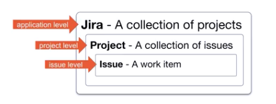
---

# Creating Projects
- When creating a new project, there are 3 pre-prepared templates in JIRA:
	- Scrum
	- Kanban
	- Bug Tracking
	- They differ based on methodology or goal
		- Bug Tracking is used to track software bugs during software development
- Issue details are called "fields"
	- Fields may change depending on the selected issue type, the summary field is the title of the created issue
---

```yaml
hideInToc: true
```
# Creating Projects
- JIRA generates a unique value (a primary key within the project) for each issue consisting of the project key and the issue number within the project
<div grid="~ cols-2 gap-4">

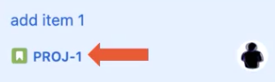
</div>
---

# Management Levels in JIRA
- In JIRA we have the following management levels:
	- Site Manager: The JIRA site manager has the ability to add users
	- JIRA Manager: Responsible for the process of creating projects, settings modified here affect all company projects
	- Project Manager: Modifies settings of a specific project
---

```yaml
hideInToc: true
```
# Management Levels in JIRA
## Settings
- Site settings
	- Manage all site details
	- May include some software from Atlassian (the company that developed JIRA)
- JIRA settings
	- Settings that include modifications only on projects
	- Since you are a site manager, you are considered a JIRA manager
- Personal settings
	- Settings that each user can change, affecting only themselves
---

# Work Modeling
<div grid="~ cols-2 gap-4">
<div>

- We rely on the concept of Todo Lists
	- Helps with focus
	- Helps with reminders
	- Organizing priorities
	- Tracking execution
</div>
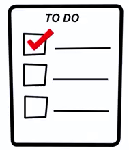
</div>

---

## Boards
- One of the basic principles in Agile methodology is work modeling
- The board is one of Agile tools used in modeling and managing tasks (work)
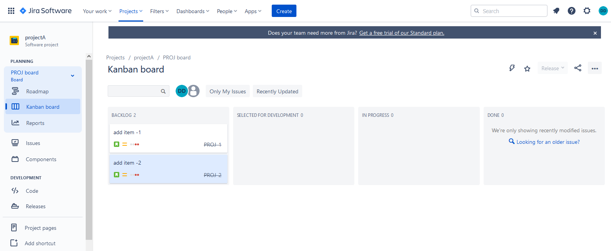
---

```yaml
hideInToc: true
```
## Boards
- In JIRA, boards are automatically generated based on the project template used
- The board in the Kanban template contains:
	- Columns: Backlog, Selected for Development, In Progress, Done
	- Each column contains a set of Issues
	- During team work, issues are moved from one column to the next until reaching the end
- Kanban can be seen as a 2D Todo List
	- The team divides the work into manageable units
---

```yaml
hideInToc: true
```
### Why do we use work modeling?
<div grid="~ cols-2 gap-4">
<div> 

- Provides a clear mechanism for tracking execution
	- Allows managers to see the real status of the project
	- Transparency in execution for the team and stakeholders
	- Helps organize and focus team work
	- Work is only done on tasks present on the board
</div>
<div>

- For management
	- Easier addition and prioritization of tasks
	- Easier updating of project tasks
- Improving team workflow
	- Identifying difficult issues
</div>
</div>
---

## WorkFlow
- The set of board columns represents the workflow for processing an issue
- We use the workflow to model processes within the project
- The workflow is divided into steps (Statuses, States, Stages)
- Each column represents a step in execution
- We conclude that boards model the workflow
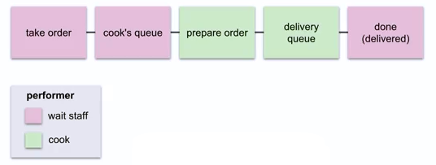
---

## Boards vs Workflow
- The team works based on the board
- The board structure is determined based on the defined workflow
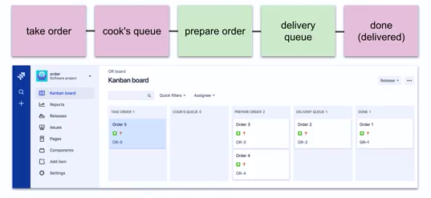
---

```yaml
hideInToc: true
```
## Boards in JIRA
- Boards are created automatically based on the used template
- You can create additional boards at any time. One project can contain multiple boards
- A single board can contain issues from multiple projects
- Each project is linked to a workflow
- The status field of each issue must be set to one of the workflow statuses
- Boards are a view of issues sorted by status
- Moving an issue changes its status field value
	- Drag and drop in Jira
- Changing issue status is called a transition
---

## Modeling View
<div grid="~ cols-2 gap-1">
<div>

- The gray dot represents creating an issue.
- The gray arrow is a transition.
- The "all" box means issues from any other state can be moved to this state.
</div>
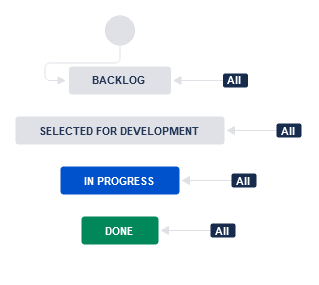
</div>
---

```yaml
hideInToc: true
```
## Creating a New Column
<div grid="~ cols-2 gap-4">
<div>

- JIRA creates a status and adds it to the workflow
- Column category is similar to status
- This category helps determine the issue position in the lifecycle
	- Only one value from three:
		- To Do: issue not started yet, gray color
		- In Progress: work ongoing, blue color
		- Done: issue completed, green color
</div>
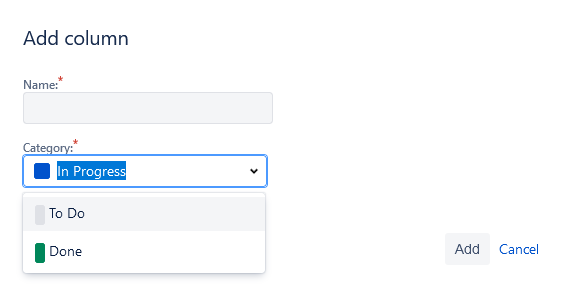
</div>
---

```yaml
hideInToc: true
```
## Creating a New Column
<div grid="~ cols-2 gap-4">
<div>

- Resultion:
	- If the choice "set" for this column, JIRA will consider The issue to be solved when reaching this column
</div>
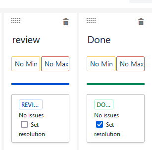
</div>
---

```yaml
hideInToc: true
```
## Creating a New Column
<div grid="~ cols-2 gap-4">
<div>

- Cards:
	- The boards view issues as a set of cards
	- These cards shows few information about the issue
	- We can customize up two 3 fields in the cards to be shown
</div>
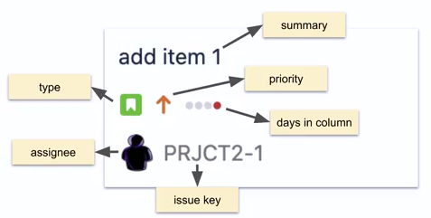
</div>
---

# Kanban
<div grid="~ cols-2 gap-1">
<div>

- Agile Methodologies
	- Approaches to achieve flexibility
		- Also called frameworks or Agile methodologies
		- It is a mindset, not an actual management approach
	- Agile methods add more structure to Agile ideas
	- Each embodies core Agile principles
		- Team empowerment
		- Continuous improvement
		- Working in small batches
		- Incremental feature addition
	- Often combined into a customized way
 </div>
 <div>
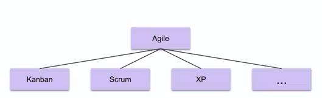
</div>
</div>
---

## Concepts
- Definition: An Agile method used to manage a continuous queue of work items.  
- Commonly Used Ideas:
	- Limiting Work In Progress (WIP):
		- Working only on a volume of work that can be handled sustainably.
		- Removing bottlenecks to improve the Value Stream.
			- The Ideal State: Producing a continuous, smooth flow of work.
			- The Reality: Issues accumulate in specific areas due to process complexity or underlying problems.
				- _Solution:_ Identify the root cause and fix the process.
			- Using a Pull system for work instead of a Push system.
---

```yaml
hideInToc: true
```
## Why Use Kanban?
- Lightweight and Efficient:
	- It is considered more lightweight compared to other frameworks like SCRUM.
	- Simple and provides high flexibility.
	- Easy to start and easy to use.
- An Evolutionary Approach to Agile Transformation:
	- You can utilize your existing team in their current roles.
	- It does not require a complete reorganization of the team structure.
- Works Well for Service-Oriented Workflows:
	- Operations, Support, Maintenance, Development, HR...
	- Any scenario that involves a continuous flow of work.
- Supports Multi-Team and Multi-Project Workflows:
	- Issues can be moved between teams using a single shared board or multiple team-specific boards.
---

```yaml
hideInToc: true
```

## Kanban Boards
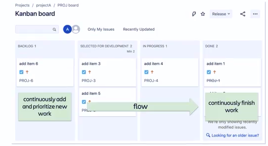

---

## Kanban Backlog Column
- In JIRA, the Backlog column can be separated from the Kanban board.
- **Advantages:**
	- The development team sees and focuses only on issues they can currently work on, as backlog items are not yet ready for action.
- **Disadvantages:**
	- The backlog may become very long and difficult to manage in this format.
	- Work within it is not visible to the rest of the team members.
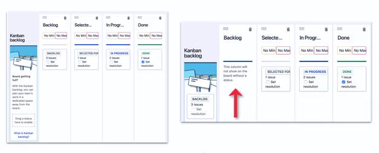
---

## Work In Progress (WIP) Limits

- We define a minimum and/or maximum number of issues allowed in specific columns of the Kanban board.
- **Why?**
	- **Better Workflow:**
		- Fewer issues handled simultaneously allows for a flow that leads to completion.
		- The team focuses on finishing current work before starting new tasks by reducing multitasking.
		- Faster issue resolution, as moving issues to the "Done" status is a primary metric of progress.
	- **Reduces Waste:** Prevents delays in the work state.
	- **Promotes Teamwork:** Encourages the removal of blockers.

---

```yaml
hideInToc: true
```
## Work In Progress (WIP) Limits
<div grid="~ cols-2 gap-4">
<div>

- Current work limits are called **Column Constraints** in JIRA.
- In JIRA, via Board Settings → Columns:
	- **Below Minimum:** The column turns yellow on the board.
	- **Exceeding Maximum:** The column turns red on the board.
</div>
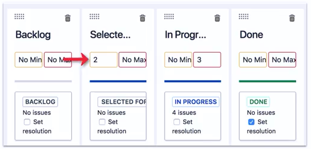
</div>
---

```yaml
hideInToc: true
```
## Work In Progress (WIP) Limits

### How to define WIP limits?
- It depends on the project and the team.
- **For example:**
	- Start without any WIP limits.
	- Add WIP limits when bottlenecks or issues appear in the process.
	- Set WIP limits to curb excessive multitasking.
	- Set WIP limits on steps that the team tends to neglect.
---

## Pull vs Push
- The developer either **pushes** work to the next step or **pulls** it from the previous step.
 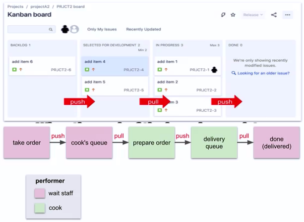
---

```yaml
hideInToc: true
```
## Pull vs Push
- We create **queues** (buffers) to enable the Pull system.
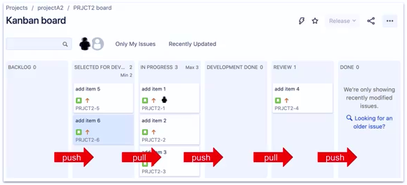
---

```yaml
hideInToc: true
```
### Why Pull vs Push
- **Why do we prefer Pull over Push?**
	- Allows team members to choose tasks that match their expertise.
	- Maintains a sustainable pace of work.
---

# Kanban Reporting
- **Why use Agile reports?**
	- **Visualize Team Work:**
		- Enhances project transparency (Transparency means no surprises regarding delivery).
	- **Troubleshooting & Continuous Improvement:**
		- Reports can clearly highlight process bottlenecks.
	- **Assistance in Planning and Estimation.**
---

```yaml
hideInToc: true
```
## Cumulative Flow Diagram (CFD)
- A common report for Kanban projects.
	- Priority is given to maintaining and improving the team's workflow.
- Reports are generally updated automatically.
- The CFD shows the number of issues in each status over time.
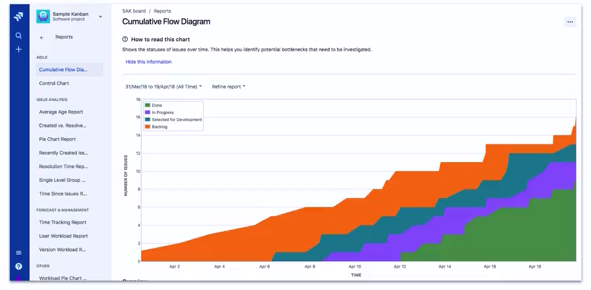
---

```yaml
hideInToc: true
```
## Lead Time vs. Cycle Time
- **Lead Time:** The total time from the creation of an issue until its completion.
- **Cycle Time:** The time from when work actually starts on the issue until its completion.
