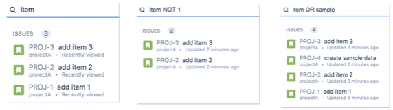
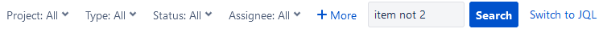
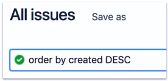
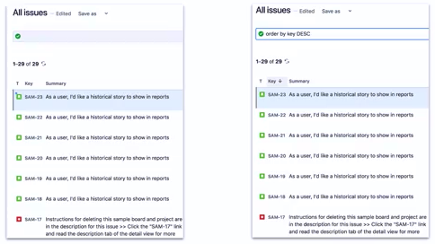
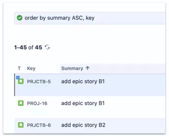
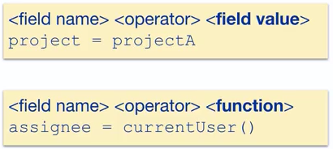

# Project Management
## Lecture 7  
### Search in JIRA


Dr. Osama Nasser  
2025-2026

---

# Search Mechanisms in JIRA
- - We have the following search mechanisms in JIRA:
	- Quick Search
	- Basic Search
	- Advanced Search
	- Filters
	- Quick Filters
	- In general, search mechanisms in JIRA search for Issues within project issues

---

# Search Mechanisms in JIRA
## Quick Search
- Quick search is performed by searching for the item in the text box above the issue list
- It accepts the use of the word not to search for the opposite
- Weak in terms of design

---

# Search Mechanisms in JIRA
## Basic Search
- We have a filter bar that can be applied to the issue list
- More powerful than quick search and is considered a visual representation of JQL

---

# Search Mechanisms in JIRA
## Advanced Search
- Advanced search in JIRA is based on the concept of JQL
- JQL is a language similar to SQL
	- It mainly focuses on the Where condition section
<div grid="~ cols-2 gap-4">
<div>

Basic Search
- Easy interface
- Queries can be complex

</div>
<div>

Advanced Search
- Based on JQL
- The most powerful search mechanism in JIRA
- JQL can be used in process automation

</div>
</div>
---

```yaml
hideInToc: true
```
# Search Mechanisms in JIRA
## Advanced Search
### JQL
- Basic search queries are usually converted to advanced
- These queries are re-represented using JQL
- The JIRA environment supports AutoComplete
	- 15 results are displayed
- By default, the resulting values are sorted by key
- Sorting can also be based on multiple columns
<div grid="~ cols-2 gap-4">
<div>

</div>
<div>

</div>
</div>
---

```yaml
hideInToc: true
```
# Search Mechanisms in JIRA
## Advanced Search
### JQL
- Basically, we work on conditions in the selection statement within JQL

---

```yaml
hideInToc: true
```
# Search Mechanisms in JIRA
## Advanced Search
### JQL
- One of the most important points in JQL is searching for issues according to specific time conditions
- It depends on searching using specific time values
- We rely on the following different time functions:
<div grid="~ cols-3 gap-4">
<div>

- Start functions
	- `startOfDay` beginning of the day
	- `startOfWeek` beginning of the week
	- `startOfMonth` beginning of the month
	- `startOfYear` beginning of the year

</div>
<div>

- End functions
	- `endOfDay` end of the day
	- `endOfWeek` end of the week
	- `endOfMonth` end of the month
	- `endOfYear` end of the year
</div>
<div>

- Other time functions
	- `now` current time
	- `currentLogin` current login moment
	- `lastLogin` previous login moment
 </div>
</div>
---

```yaml
hideInToc: true
```
# Search Mechanisms in JIRA
## Advanced Search
### JQL
- Examples
- We want to search for the following issues:
<div grid="~ cols-2 gap-4">
<div>
<v-clicks depth="3">

- First group
	- Created before the start of this week
		-  `created < startOfWeek()`
	- Created since the beginning of this month
		- `created >= startOfMonth()`
	- Created by the current user
		- `creator = currentUser()`
</v-clicks>
</div>
<div>
<v-clicks depth="3">

- Second group
	- Whose approval is pending
		- `approval = pending()`
	- Whose approval is pending by user jDoe
		- `approval = pendingBy(jDoe)`
	- Not assigned to the current user
		- `assignee != currentUser()`

</v-clicks>
</div>
</div>
---

```yaml
hideInToc: true
```
# Search Mechanisms in JIRA
## Advanced Search
### JQL
- Examples
- We want to search for the following issues:
<v-clicks depth="3">

- Sorting support
	- Issues whose due date ends today sorted by creation date descending
		- `due <= endOfDay() order by createdDate desc`
	- Issues whose status is open sorted by due date ascending
		- `status =Open order by dueDate asc`
</v-clicks>
---

```yaml
hideInToc: true
```
# Search Mechanisms in JIRA
## Advanced Search
### JQL
- Some fields have an Alias
	- `created <=> createdDate`
	- `due <=> dueDate`
- Additional operators
	- was operator
		- Indicates finding an issue where the field value matched the passed value
		- Can be negated using not
	-  ~
		- Indicates that the text contains a value, i.e. contains
		- Can be negated using not
---

```yaml
hideInToc: true
```
# Search Mechanisms in JIRA
## Advanced Search
### JQL

- We want to find issues that were assigned to the current user
	- `assignee was currentUser()`
- We want to find issues that did not transition to the in progress state
	- `status was not "In Progress"`

---

```yaml
hideInToc: true
```
# Search Mechanisms in JIRA
## Advanced Search
### JQL

- More complex examples
<v-clicks depth="3">

- Write the following queries
	- We want to display all issues that were moved to the In Progress or Selected For Development status during the past month
		- `status was in ("In Progress","Selected For Development") After -1M `
	- We want to display issues that were created within a period of 72 hours
		-  `created > -3d`
	- We want to display issues created since the 15th of the current month whose status is "Selected For Development"
		-  `created > startOfMonth(+14d) and status = "Selected For Development" `
</v-clicks>

---

```yaml
hideInToc: true
```
# Search Mechanisms in JIRA
## Advanced Search
### JQL

 - The was operation has many features including:
	- was in / was not in for use with more than one value
	- after the was condition is checked after a specific time period
	- before the was condition is checked before a specific time period
	- BY by a specific user
	- During ("date1","date2") between two dates
	- On "date" according to a specific date

---

```yaml
hideInToc: true
```
# Search Mechanisms in JIRA
## Advanced Search
### JQL
-  is operation
	- According to the JIRA documentation, this operation only works with fields that accept NULL or EMPTY values
	- More precisely, only fields that have this value (i.e. do not accept any values other than null or empty)
	- It is negated using is not
---

```yaml
hideInToc: true
```
# Search Mechanisms in JIRA
## Advanced Search
### JQL
- Time specifiers
	- Time can be handled using time offsets
	-  `-2d` means 48 hours before this moment
	- Includes - for previous / + for next
	- With the following specifiers
<div grid="~ cols-2 gap-4" >
<div>

- y for year
- M for month
- w for week
</div>
<div>

- d for day
- h for hour
- m for minute
</div>
</div>

- The full expression is
	- (-|+)nn(y|M|w|d|h|m)

---

```yaml
hideInToc: true
```
# Search Mechanisms in JIRA
## Advanced Search
### JQL
- changed operator
	- Works to search for fields whose value changed from one value to another
		-  status changed from "In Progress" to "done"
	- It has the following properties (one or more can be used, or none)
		- after condition checked after a specific time period
		- before condition checked before a specific time period
		- BY by a specific user
		- During ("date1","date2") between two dates
		- On according to a specific date
		- from from a value
		- to to a value
---

```yaml
hideInToc: true
```
# Search Mechanisms in JIRA
## Advanced Search
### JQL
- Examples
<v-clicks depth="3">

- Solve the following:
	- Search for issues where the responsible user changed
		- `assignee chaged`
	- Search for issues whose status changed from "Backlog" to "selected for development" by user jDoe
		- `status changed from "Backlog" to "Selected For Development" by jDoe`
</v-clicks>
---

# Filters
## Definition
- They are searches (which can be JQL queries) saved for quick application
- That is, after creating the query, we save it for later use instead of recreating it again
- Special types of filters
	- Board Filter
		- Every board (regardless of its type) within the board display mechanism has its own filter to display issues matching that Board
		- For example, this board displays issues related to only one project or two different projects
		- Related to team A
		- Or within a specific Sprint
---

# Issues
## Types of Issues
- The expression "issue" is an inaccurate expression resulting from translating the word issue from English to Arabic
- Not all issues are actually problems, rather:
	- Story represents a requirement from the user's point of view (another name is Feature Request)
	- task is an issue the team works on that is not necessarily directly related to a user requirement
		- For example, in a multi-user system, although the customer did not mention a user management mechanism, it must be implemented
	- bug is a software weakness that must be fixed
	- Epic is a large issue that includes sub-issues
	- subtask is an issue that is part of another issue
	- You can also generate your own custom issue types
---

# Issues
## Why Issue Types?

- Supports different types of work items
	- Usually the team has more than one type of work
- Each type has different fields, screens, and workflows
	- You may want bugs to appear at the top of the project board
- Reports can be configured separately for each type
	- Example: a report on the number of bugs fixed in the previous week
---

# Issues
## Subtasks
- An issue type that must have a main (parent) issue  
- Allows dividing the issue into individual tasks that can be managed easily
- May include technical details not present in the parent issue  
- For example:  
	- If the parent issue is a "User Story", it may be written in non-technical language understood by team members and stakeholders  
	- While Subtasks can be written for technical personnel in specialized technical language
- Parent issue: such as the user story or main task
- Subtasks: technical or implementation details that concern developers/the technical team
----

# Issues
## Subtasks
- Have their own issue key and independent fields
- Follow an independent workflow with special stages    
- Move on the project board separately from the parent issue
---

# Issues
- The Issue Type Schema defines the issue types applied to this project.
- To change the issue types used:
	- You can choose a different issue type schema
    - Or modify the currently selected schema
- From Project Settings -> Issue Types
- Each issue type can contain:
	- Its own workflow
    - Custom field configuration
    - Unique screen schema
---

# Issues
- Among the issue configuration mechanisms
	- Defining Labels
	- Defining the issue display mechanism and the fields to display through the screen
	- Custom fields
