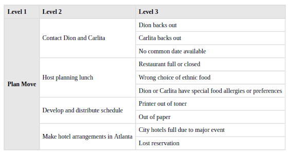
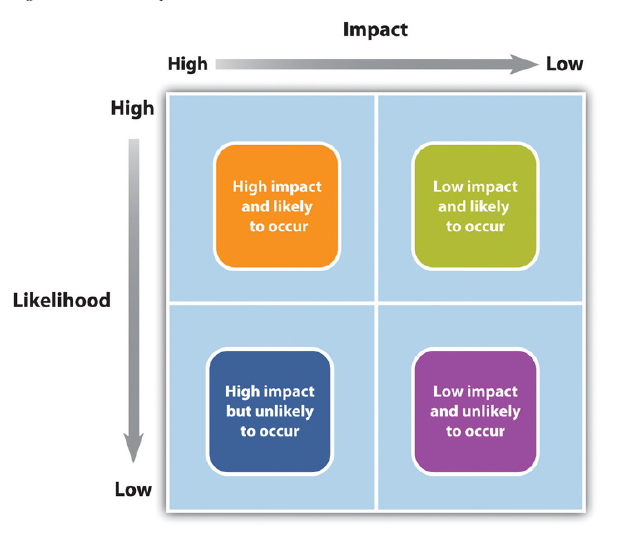

# Project Management
## Lecture 8  
### Risk Management


Dr. Osama Nasser
2025-2026

---

```yaml
hideInToc: true
```
# Index
<toc/>
---

# Introduction
- As a project manager, you must consider the possibility of problems when developing the project plan and budget, because problems will inevitably occur.
- Therefore, you should create a project plan that is flexible enough to handle events that could delay execution, reduce quality, or increase the budget. 
## Risk and Risk Management 
- **Definition of Risk** : A risk is defined as an uncertain event or situation that, if it occurs, could affect at least one of the project's objectives.
- **Definition of Risk Management**: Risk management involves identifying, assessing, and managing risks that could affect the project in order to minimize their impact as much as possible.
- No project is entirely risk-free, as the number of events that could negatively affect a project is virtually limitless. Therefore, risk management does not aim to eliminate risk, but rather to identify, assess, and manage risks.
---

# Risk and Risk Management
- Studies have shown the following: 
	- Risk management is not widely used.
	- Projects that were more likely to have a risk management plan were considered high-risk.
	- Risk management influenced the meeting that determined the timeline and budget, but had less impact on the quality of the project's final product.
	- Successful risk management increases the chances of project success.
---
	
```yaml
	hideInToc: true
```
# Risk and Risk Management
 - Risk management addresses the possibility of events that could affect a project.
 - It should be noted that the events that could affect a project vary from one project to another, such as:
	 - Safety from risks in construction projects.
	 - Currency fluctuations during the project affect purchasing power and the budget.
	 - Projects that rely on favorable weather conditions can be affected by weather changes such as wind and humidity
	 - The Normandy landings in World War II.
	 - A military operation carried out by the Allies to break through Nazi fortifications on the French coast opposite Britain and gain a foothold in France.
	 - The unpredictable weather in England affected the execution of the operation and caused several delays. Days
---

```yaml
 hideInToc: true
```
# Risk and Risk Management 
 ## Project Risks and Organizational Risks
 - We must distinguish between project risks and organizational risks related to the commercial aspects of the project.
 - Let's consider, for example, the case of building an iron ore mine. Although the mine is built within the specified timeframe and budget, a drop in the price of iron below the profit threshold causes a loss for the organization, despite the project's success.
 - In other words, organizational risks arise from problems in the project's economic feasibility study (which determines when a project is profitable) or from economic changes beyond the organization's control, such as natural disasters, fluctuations in raw material prices, and so on. 
---

# Risk Management Process
- The risk management process is divided into:
	- **Risk Identification:** Identifying the risks that the project may face
	- **Risk Assessment:** Studying these risks and determining their level of impact on the project lifecycle
	- **Risk Mitigation:** Developing plans that outline how to address risks should they occur
---

## Risk Identification
- The risk identification process for a project relies on past experiences with similar projects or those in the same field.
- Based on this, a set of checklists has been developed to identify the most likely risks to occur in a project, drawing on analytical studies of numerous projects in the same field.
- These checklists can help the team identify potential risks or broaden their perspective. In addition to the team's past experiences, expert opinions and the organization's own experience are key sources for risk identification.
- For I.T. we can for example:
	- Identify underlying technology limitation
	- Consider security risks
	- The effects of tools used in development on performance of employees in negative manner
	- Is the tools and technology used suitable for the size of the project
---

```yaml
hideInToc: true
```
## Risk Identification

- An additional method for assessing risks involves classifying them into categories that include:
	- **Technology:** A particular technology might be used to build a project, only to later prove unsuitable. For example, using a specific library to build the graphical user interface (GUI) for a software system might prove ineffective, requiring the selection of a new library and rewriting the interface from scratch.
	- **Financial Estimates (Costs):** Sometimes, the estimated project cost is inaccurate. For instance, the prices of some materials might be underestimated, leading to budget problems. Cost reductions in certain areas may be necessary to address this.
	- **Timeline:** The project timeline could be exceeded if certain aspects were not properly considered.
	- **Customer:** The customer might change their mind at any time or withdraw from the project entirely.
---

```yaml
hideInToc: true
```
## Risk Identification
- **Contract:** The contract may not be clearly worded or provide sufficient protection for the contractor or the client.
- **Weather:** Weather fluctuations may cause delays in project implementation or damage to materials.
- **Financial:** The project's financial manager may be embezzling funds, hindering implementation due to a lack of resources, or funding may be suspended at any time for various reasons.
- **Political:** Changes in the laws of the country where the project is being implemented, or widespread political changes such as nationalization, may cause radical alterations to the project's implementation mechanism. International pressure, such as the imposition of sanctions on the country, may also be a factor.
- **Environmental:** The project's implementation may have environmental impacts that have not been adequately studied, or some materials used in the project may have a negative environmental impact, potentially endangering workers, residents in the surrounding area, or the environment in general.
- **Risks from individuals:** Examples include not finding an individual with the necessary skills to carry out the project or the sudden unavailability of key people in the project, for example, the absence of the project manager or chief engineer due to a family emergency (death, for example) or as a result of a sudden deterioration in health due to a traffic accident, heart attack, etc.
---

```yaml
hideInToc: true
```
## Risk Identification
<div grid="~ gap-4 cols-2">
<div>

- The Risk Breakdown Structure (RBS) technique can be used to define risks according to increasingly detailed levels, as shown in the images. The image shows three levels:
	- The first identifies the main project.
	- The second identifies the steps needed to implement this project.
	- The third identifies the risks associated with each step.
</div>
<div>

</div>
</div>
---


```yaml
hideInToc: true
```
## Risk Identification
<div grid="~ gap-4 cols-2">
<div>

- It is not necessary to have only three levels; it can be four or more depending on the project.
- Also, the first level does not need to define the main project, as it can define the main stages of the project, and the steps are detailed in the lower levels and the risks are identified.
</div>
<div>

</div>
</div>
---

## Risk Assessment

<div grid="~ cols-2 gap-4" >
<div>

- Risks are assessed based on:
	- Probability of occurrence, from highest to lowest probability
	- Impact of the risk, from highest to lowest
- As a result, risks are divided into four levels:
	- High probability and high risk: The most dangerous risk, and preparations must be made for it
	- High probability and low risk: Preparations are necessary, but not to the same extent as above
	- Low probability and high risk: Despite the high risk, the low probability of occurrence allows us to ignore this risk
	- Low probability and low risk: Ignore it and you'll live well
</div>
<div>

</div>
</div>
---

```yaml
hideInToc: true
```
## Risk Assessment
- Some managers are more proactive and develop detailed risk management plans for their projects.
- Others are reactive because they are more confident in their ability to handle unexpected events without prior planning.
- Some managers are optimistic and either disregard risks or avoid them whenever possible.
- In low-complexity projects, the project manager may informally track elements that could be considered risk factors.
- In more complex projects, the project management team may create a list of elements considered high-risk and track them during periodic meetings.
- In projects of greater complexity, the risk assessment process is more formal, with a risk assessment meeting or a series of meetings throughout the project lifecycle to assess risks at different stages.
- In highly complex projects, an external expert may be involved in the risk assessment process, and the risk assessment plan may play a prominent role in the project implementation plan.
- In complex projects, statistical models can be used for risk assessment due to the large number of potential risks, allowing for the calculation of their probability of occurrence one by one.
---

## Risk Mitigation
- After identifying and assessing risks, plans should be developed to mitigate their impact. Various methods can be used, including:
	- Avoidance
	- Sharing
	- Reduction
	- Transfer
	- Contingency Plan
---

```yaml
hideInToc: true
```
### Avoidance
- Risk avoidance typically involves developing an alternative strategy with a higher probability of success, even at the higher cost associated with completing a project task.
- One common way to avoid risk is to use proven, established technologies rather than adopting new ones, even if the new technologies promise better performance or lower costs.
- Many NASA-developed exploration spacecraft rely on relatively old processors because all the problems with these processors are well-known.
- A project team might choose a vendor with a proven track record over a new supplier offering significant price incentives to avoid the risks of working with a new vendor.
---

```yaml
hideInToc: true
```
### Partnership/Sharing
- This relies on the principle of building a partnership with others to share the negative impacts of risks among different parties, distributing the negative impact across multiple entities instead of a single one.
- This is a commonly used mechanism in international projects. For example, an organization might win a contract to implement a project in another country. While it may possess sufficient expertise to execute the project, it lacks the necessary experience to navigate the legal, political, and labor laws of that country.
- Therefore, partnering with a local organization that possesses the expertise to handle these details reduces the negative impacts of the risk on the main organization or allows the local organization to bear the entire risk in exchange for a larger share of the profits.
---

```yaml
hideInToc: true
```
### Reduction
- This involves investing funds to reduce project risk.
- In international projects, organizations often purchase currency guarantees to mitigate the risks associated with exchange rate fluctuations.
- A project manager may hire an expert to review the project's technical plans or cost estimates to increase confidence in the plan and reduce project risk.
- Assigning highly skilled project staff to manage high-risk activities is another way to reduce risk.
- Experts managing high-risk activities can anticipate problems and find solutions that prevent activities from negatively impacting the project.
- Some organizations reduce risk by preventing key executives or technology experts from traveling on the same plane.
---

```yaml
hideInToc: true
```
### Transfer
- This process transfers the negative effects of risk from one party to another, typically through insurance. The risk is transferred from the executing party to the insurer, thus reducing the negative impact of the risk.
- It should be noted that repeated risks affecting an organization's projects lead to increased insurance premiums.
---

```yaml
hideInToc: true
```
### Contingency Plan
- A project risk management plan balances the investment in mitigating impacts against the project's return on investment.
- The project team often develops an alternative method to achieve the project goal when a risk event is identified that could derail that goal.
- These plans are called contingency plans. If a critical piece of equipment is delayed, the impact on the schedule can be mitigated by making adjustments to accommodate the delayed delivery.
- Contingency funds are money allocated by the project team to address unforeseen events that increase project costs.
- High-risk projects typically have a large contingency budget. Although the contingency amount allocated in the project budget is a function of the risks identified in the risk assessment process, contingency funds are usually managed as a single line item in the project budget.
---

```yaml
hideInToc: true
```
### Contingency Plan
- Some project managers allocate contingency funds to high-risk budget items rather than developing a single contingency budget line.
- This approach allows the project team to track contingency spending against the risk plan.
- This approach also assigns responsibility for managing the risk budget to the managers responsible for those items.
- Having contingency funds available in the budget line might lead to over-reliance on contingency funds to fix problems instead of finding less costly alternatives. Most project managers, especially on more complex projects, will manage contingency funds at the project level, ensuring that no funds are disbursed from the contingency budget without the project manager's approval.
---

# Project Risks Across Phases
- **Initiation Phase**: Risks are associated with unknowns. Many things are unknown at the start of a project, but risks must be considered at the initiation phase and weighed against the potential benefits of project success to determine whether the project should be chosen.
- **Planning Phase**: Once the project is approved and moves into the planning phase, risks are identified for each major set of activities. A Risk Breakdown Structure (RBS) can be used to identify incremental levels for detailed risk analysis.
---

```yaml
hideInToc: true
```
# Project Risks Across Phases
- **Implementation Phase:** As the project progresses and the team gains more information, the overall project risk decreases as activities are completed without loss.
	- Therefore, the risk plan should be updated based on new information, and risks related to completed activities should be examined.
	- Understanding where risks occur within the project is crucial for managing the contingency budget and cash reserves.
	- Most organizations develop a plan to finance the project from existing resources, including financing through a variety of financial instruments. In most cases, there is a cost to the organization to keep these funds available for the project, including the contingency budget.
	- As risks decrease over the project's duration without using contingency funds, these funds can be used for other purposes. To determine how much contingency money can be forfeited, the team conducts another risk assessment and determines how much risk remains in the project.
	- If the outcome involves fewer risks, the team may return the contingency funds to the parent organization. If additional risks are identified, a new management plan is developed, including the possibility of allocating additional contingency funds.
---

```yaml
hideInToc: true
```
# Project Risks Across Phases
- **Closing Phase:** Risk-sharing and transfer agreements must be concluded, and the distribution structure reviewed to ensure that all events have been avoided or mitigated. A final assessment of the loss due to risks can be conducted and recorded as part of the project documentation.
