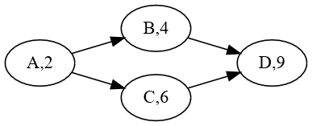
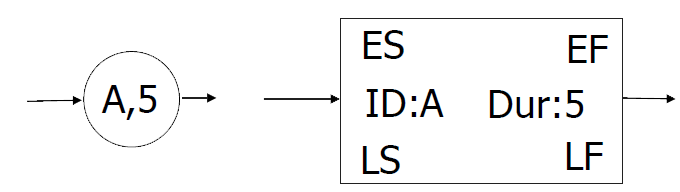
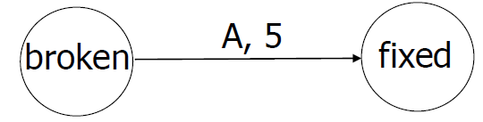
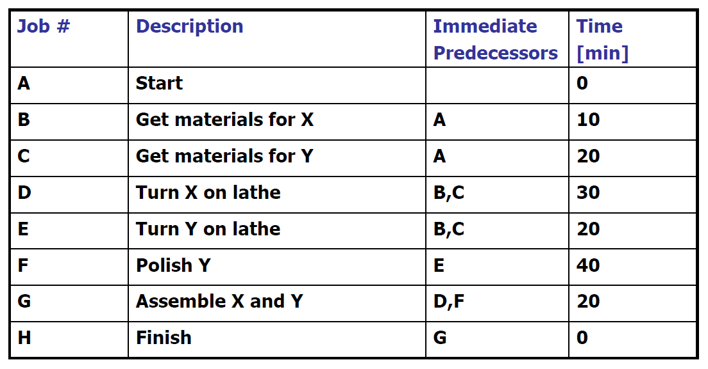
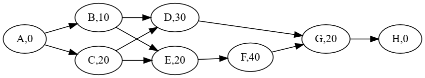
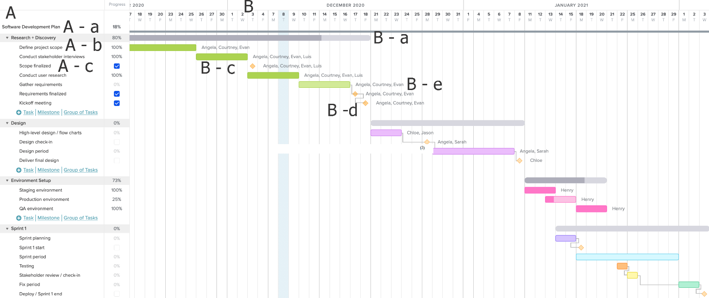
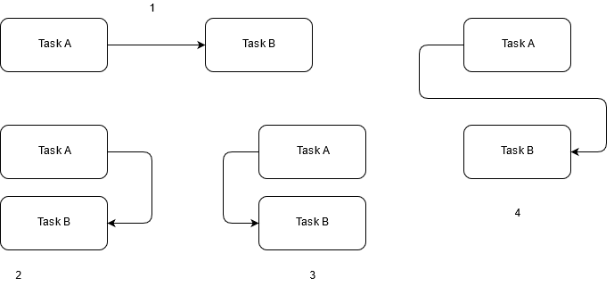

# Project Management
## Lecture 8  
Time & Money


Dr. Osama Nasser
2025-2026

---

```yaml
hideInToc: true
```
# Index
<toc maxDepth="2"/>
---

# Time Estimation
## Project Timeline (Scheduling) Definition
- A timeline (or schedule) is defined as a timetable that organizes project tasks, activity durations, and calendar start and end dates, while mapping out the overall project milestones on a chronological chart. It also identifies the team members and resources required to complete the tasks.
## Importance in Project Management
- Project scheduling is fundamental for planning and control within project management. All work necessary to complete the deliverables is accounted for in the project schedule; it also includes all associated costs as outlined in the project budget.
---

```yaml
hideInToc: true
```
## The Art and Science of Project Planning
- Project planning and scheduling is both an art and a science. No two project managers or planning professionals will develop identical plans or schedules.
## The Creative Process
- The planning process is creative and reflects the unique approach and style of the planner.
- Although a project plan is unique to the planner's approach and style, the methods for developing the schedule and documenting the resulting plan follow specific, established rules.
---

## Planning and Scheduling Roles
- In large and complex projects, a dedicated function composed of a small team of planning and scheduling experts may be required to develop and track the project schedule.
	- **The Role of Planners:** Project planners facilitate the gathering of information needed to develop the project plan. They utilize templates, data from past or similar projects, and, most importantly, the insights and plans of the project leaders and team members.
	- **Small-Scale Projects:** In smaller projects, the project manager may be solely responsible for handling this planning function.
---

## Developing the Master Schedule
- After gathering this information, the planner begins developing the **Project Master Schedule**—a summary schedule that encompasses the entire scope of the project, incorporates key milestones, and provides a bird's-eye view of the whole project.
### Evolution of the Schedule
- Working alongside the project team, the planning process continues to incorporate more detail as additional information becomes available.
> **Continuous Updates:** The schedule continues to evolve throughout the project life cycle. Major revisions may become necessary in response to both internal and external events that alter critical dates within the timeline.

---

## Types of Timelines (Schedules)

| **Type**       | **Description**                                                                                                                           | **Key Characteristics**                                                                                                                                                                                                                                                                 |
| -------------- | ----------------------------------------------------------------------------------------------------------------------------------------- | --------------------------------------------------------------------------------------------------------------------------------------------------------------------------------------------------------------------------------------------------------------------------------------- |
| **Conceptual** | A simple schedule showing major tasks and approximate start and end dates to allow senior management to make decisions about the project. | Details are not required at this stage because entire tasks may be dropped from the scope, or the project as a whole may not be approved.                                                                                                                                               |
| **Master**     | Created if the project is selected and approved. It includes major events and key dates, such as the overall start and end dates.         | It is often part of the contract. Any changes to this schedule must go through a documented change process and receive approval from both the project sponsor and the client.                                                                                                           |
| **Detailed**   | To execute the master schedule, major activities are broken down into smaller tasks, and resources are allocated to them.                 | Highly detailed versions or segments of the schedule may be developed just a few weeks before those activities are executed (often called **two-week look-ahead plans**). Relevant portions may also be sent to specific suppliers so they can detail the activities they will perform. |

---

## Types of Timelines
- Critical Path
- Gnatt Chart
---

### Critical Path Method
- It works on representing the project as a set of interconnected tasks within a network using the concept of a graph (network diagram). It is characterized by its ability to identify tasks, specify their durations, and demonstrate their interdependencies with one another.
 
#### Method Assumptions for Building the Diagram
- To build the diagram, this method assumes the following:
	- **Defined Tasks:** The project consists of a set of clearly defined tasks.
	- **Project Completion:** The project ends when all tasks are completed.
	- **Independent Execution:** Tasks can start and finish independently of one another.
	- **Sequential Order:** Tasks have a specific execution order (sequence).
---

#### Styles of Critical Path Method
<div grid="~ cols-2 gap-1">
<div>

- **Activity on Node (AON) Notation:** Representing the activity as a graph node, either in the form of a circle containing the activity ID and its duration, or as a rectangle (box) containing the activity ID, its duration, Early Start (ES), Late Start (LS), Early Finish (EF), and Late Finish (LF).

</div>
<div>
   
- **Activity on Arrow (AOA) Notation:** Representing tasks as the arrows (edges) of the graph, which illustrate the transition of the project from one state (event/node) to another.

</div>
</div>
---

```yaml
hideInToc: true
```
#### Styles of Critical Path Method
##### 1. Start Dates
- **Early Start (ES):** Defined as the earliest possible time an activity can begin. 
- **Late Start (LS):** The latest possible time an activity can begin without delaying the overall project completion time.
##### 2. Finish Dates
- **Early Finish (EF):** Defined as the earliest possible time an activity can end, representing the expected completion time for that specific activity.  
- **Late Finish (LF):** The latest possible time an activity can end, representing the ultimate deadline that the activity's execution must not exceed so the project is not delayed.
##### 3. Project Flexibility
- **Slacking (or Float):** Defined as the difference between Late Start and Early Start ($Slack = LS - ES$), or alternatively, Late Finish and Early Finish ($Slack = LF - EF$).  
> **Note on Critical Tasks:** Some tasks may not have any slack available. For these critical tasks, the Early Start and Late Start dates are identical ($Slack = 0$). Any delay in these tasks will directly delay the entire project.

---

#### Critical Path
- The **critical path** is the longest sequence of dependent tasks that must be completed on time from start to finish to successfully close a project.
- It dictates the **minimum total duration** of the project. If any single task on this path experiences a delay, the entire project completion date will be pushed back by that same amount of time.

#### Key Characteristics of the Critical Path
- **Zero Slack (or Float):** The tasks sitting directly on the critical path have a flexibility or "slack time" of zero ($Slack = 0$). This means their Early Start dates and Late Start dates are perfectly identical.
- **The Longest Sequence:** While it represents the longest duration of combined tasks through the project network, it actually determines the _shortest possible time_ in which the overall project can be finished.
- **Dynamic Nature:** A project can have more than one critical path running in parallel. Furthermore, if a non-critical task outside the path gets delayed significantly beyond its allowed buffer, it can become part of a _new_ critical path.
---

```yaml
hideInToc: true
```
#### Critical Path
##### Why is it Important?
- Identifying the critical path allows project managers to apply the **Critical Path Method (CPM)** to focus energy where it matters most:
	1. **Prevents Bottlenecks:** It isolates exactly which tasks require strict monitoring so resources are not wasted micromanaging flexible tasks.
    2. **Optimizes Resource Allocation:** If a project falls behind schedule, project managers know they must reallocate personnel or equipment specifically to tasks on the critical path (a process known as _crashing_ or _fast-tracking_) to compress the schedule.
    3. **Improves Risk Assessment:** It helps clearly communicate to stakeholders and clients exactly which deadlines are rigid and which have some "wiggle room."
---

```yaml
hideInToc: true
```
#### Critical Path
##### The Activity Table
In the Critical Path Method (CPM), activities are detailed within a table that specifies the following:
- **Activity ID:** A unique identifier for each task.  
- **Activity Description:** A brief explanation of the work involved.
- **Duration:** The time required to complete the activity.
- **Dependencies (Predecessors):** The preceding activities that must be completed before this activity can begin.
This table is highly beneficial for constructing network diagrams, as it clearly illustrates the tasks and their hierarchical sequence.
##### Handling Multiple Project Starts or Finishes
- **Dummy Start Node:** In case there isn't a single starting activity (i.e., the project begins with two or more independent activities that do not rely on any predecessors), a **Start Activity** with a duration of $0$ is created to tie them together.
- **Dummy End Node:** Similarly, if there isn't a single final activity at the end of the project, a **Finish Activity** with a duration of $0$ is created to close the network diagram.'
---

```yaml
hideInToc: true
```
#### Critical Path
- **Example**

---

```yaml
hideInToc: true
```
#### Critical Path
- **Example**, The resulting critical path chart

---

### Gantt Charts
- Gantt charts are bar charts developed at the beginning of the 20th century by Henry Laurence Gantt. They were notably utilized in several major projects during World War I.
#### Structure and Visual Representation
- In these charts, activities are represented as horizontal bars, where the length of each bar corresponds to the time required to complete that activity. This bar is plotted against a clear, specific timeline axis located either at the top or the bottom of the chart.
	- **The Baseline:** The primary activity line is called the baseline.
    - **Progress Tracking:** Progress in executing an activity is visualized either by drawing a second line beneath the baseline bar or by shading/re-coloring the baseline bar to reflect the percentage of completion.
#### Modern Software Integration
- Modern project management software automatically generates Gantt charts from activity data. These tools can also apply various modifications to the charts to increase the density of the information displayed, showing dependencies, milestones, and resource assignments.
---

#### Example of Gnatt Chart

---

```yaml
hideInToc: true
```
#### Example of Gnatt Chart
##### A represents the Activity List to be executed within the project. It can consist of:
- **A – a:** A summary (main) activity.   
- **A – b:** A set of sub-activities (sub-tasks).    
- **A – c:** Milestones. Milestones signify a major threshold, phase, or significant event in the project that must be achieved.   
##### B represents the Timeline / Execution Durations:
- The timeline is traditionally represented in days or weeks; however, modern software can utilize a standard calendar for tracking.    
- **B – a** represents the task bar for the summary activity (**A – a**). Notice that a portion of it is shaded/colored to express the progress or level of completion for this activity.    
- **B – c** represents the task bar for a sub-activity.    
- The orange markers (**B – d**) represent the milestones.    
- **B – e** indicates the assignees (the specific team members or resources) responsible for executing these tasks.
---

## Time Estimation Methodology
### Methods
#### 1. Analogous Estimation (Historical Expertise)
In this method, time estimates are built based on data from similar past projects. It is also possible to develop a parametric digital system capable of estimating time and cost. While this is a highly effective option in industries like construction, it requires a large historical repository of past projects to accurately build and rely on that expertise.
#### 2. PERT (Three-Point Estimating)
PERT stands for **Program Evaluation and Review Technique**. This technique works by establishing three distinct duration estimates for a project task:
- **Optimistic (Best Case)**   
- **Pessimistic (Worst Case)**
- **Most Likely**

This method is highly effective when a project is unfamiliar or contains many ambiguous factors. Based on this uncertainty, the team structures their estimates while explicitly accounting for the best and worst-case scenarios.

---

```yaml
hideInToc: true
```
### Methods
#### 3. The Delphi Technique
This technique relies on the principle of gathering multiple independent perspectives. It requires several experts to provide their project estimates completely isolated from one another.

To ensure unbiased results, the estimates are submitted anonymously so that no expert's opinion is influenced by the reputation or status of others.

After reviewing the collective, anonymous feedback, the experts are asked to revise their estimates. This process is repeated for several rounds, and the arithmetic mean of the final round is taken as the definitive estimate.

---

### Style of Estimation
#### 1. Top-Down Estimating
This method is primarily used in large-scale projects or during the initial phase of estimation. It involves estimating the overall cost and duration of the main (summary) tasks first, and then allocating those costs and time down into their respective sub-tasks.
#### 2. Bottom-Up Estimating
In this approach, the specific time and financial costs are determined at the lowest sub-task level first. The total cost and duration of the main (summary) tasks are then built up by aggregating the individual costs and durations of their respective sub-tasks.

---

### Task Dependencies (Relationships)
- One of the fundamental aspects of planning any project is determining the execution order or the dependencies between tasks, as projects naturally contain tasks that rely on others to be completed.
- We distinguish four types of task dependencies:
	- **Finish-to-Start (FS):** The completion of one task triggers the start of another task (1)
	- **Start-to-Start (SS):** Both tasks must start at the same time (3)
	- **Finish-to-Finish (FF):** Both tasks must finish at the same time (2)
	- **Start-to-Finish (SF):** This rare relationship occurs when the start of one task determines the completion (finish) of another task (4).
---

```yaml
hideInToc: true
```
### Task Dependencies (Relationships)


---

# Finical Estimation
-  Estimating a project required finical commitment is a complex endeavor
- Based on the size of the project we can:
	- **Small Size** project manager can be responsible about estimating the needed budget
	- **Big Size** might need a team or an expert to be responsible about estimating the needed budget
- The major hurdle of estimation: Inflation
---

## The Core Components of Project Costs
- Before choosing an estimation technique, you need to account for the different types of financial outlays within a project:
	- **Direct Costs:** Expenses directly tied to a single project activity (e.g., development team salaries, specific software licenses, raw manufacturing materials).
	- **Indirect Costs (Overhead):** Expenses shared across multiple projects or the entire organization (e.g., office rent, utilities, general administrative support).
	- **Fixed Costs:** Costs that remain constant regardless of the project's scale (e.g., buying a specific hardware setup).
	- **Variable Costs:** Costs that fluctuate based on the volume of work or duration (e.g., cloud computing usage fees, hourly contractors).
---

## Common Financial Estimation Methods
Depending on the project's lifecycle stage and the granularity of information available, project managers choose between several core techniques:
### Top-Down vs. Bottom-Up

|**Method**|**Approach**|**Best Used For...**|**Accuracy**|
|---|---|---|---|
|**Top-Down Estimating**|The overall budget is determined first (often based on high-level constraints or executive mandates) and then divided down among major phases.|Early-stage feasibility studies or when detailed scope is unavailable.|Lower (Rough Order of Magnitude)|
|**Bottom-Up Estimating**|Costs are calculated for individual sub-tasks at the lowest level of the Work Breakdown Structure (WBS) and then aggregated (rolled up) to find the grand total.|Detailed planning phases when the exact scope and task list are clear.|Higher (Definitive Estimate)|

---

### Algorithmic and Expert-Driven Methods
- **Analogous Estimating:** Uses the actual cost of previous, similar projects as the basis for estimating the current project. It is fast and inexpensive but relies heavily on historical similarities being accurate.   
- **Parametric Estimating:** Uses a statistical relationship between historical data and other variables (parameters) to calculate a cost estimate.   
    - _Example:_ If historical data shows that writing secure code costs $150$ per line, and the new feature requires roughly $2,000$ lines of code, the parametric estimate is $2,000 \times 150 = \$300,000$.       
- **Three-Point Estimating (PERT):** Accounts for financial risk and uncertainty by calculating three separate cost figures:
	- **Optimistic Cost ($C_o$):** Best-case scenario where everything goes perfectly.   
    - **Pessimistic Cost ($C_p$):** Worst-case scenario involving unexpected roadblocks.
	- **Most Likely Cost ($C_m$):** The realistic cost under normal conditions.    
    The final estimate is often weighted using the beta distribution formula:  
     $$Expected\ Cost = \frac{C_o + 4C_m + C_p}{6}$$

---

## Factoring in Risk: Contingency and Management Reserves
A common point of confusion is how estimates transition into an approved project budget. Financial plans must include buffers for uncertainty.
- **Cost Baseline:** The sum of all estimated work package costs plus **Contingency Reserves**. Contingency reserves are funds allocated for "known-unknowns"—risks that you have identified during planning (e.g., a potential $10\%$ price hike from a supplier). The project manager controls the budget.   
- **Project Budget:** The Cost Baseline plus **Management Reserves**. Management reserves are funds set aside for "unknown-unknowns"—completely unpredictable events (e.g., sudden regulatory shifts or natural disasters). This budget is usually controlled by senior leadership or the project sponsor, not the day-to-day project manager.
---

## Key Financial Metrics for Evaluation
Once estimates are established, organizations evaluate the financial viability of a project using several standard formulas:
- **Return on Investment (ROI):** Measures the profitability of the project relative to its cost.
- **Payback Period:** Calculates the time it takes for the project to generate enough net cash flow to recover its initial investment.
- **Net Present Value (NPV):** Evaluates the project's profitability by analyzing current and future cash inflows and outflows, adjusted for the time value of money. A positive NPV generally indicates a financially viable project.
---

## Inflation
- The bane of any project is inflation
	- **Inflation** is the general, progressive increase in the prices of goods and services across an economy over time.
	- When inflation occurs, every unit of currency buys a smaller percentage of a good or service. In simple terms: **inflation erodes the purchasing power of your money.** If a cup of coffee cost $2 ten years ago and costs $4 today, that is inflation at work. Your money hasn't lost physical value, but its _real_ value—what it can actually buy—has dropped.
---

### How is Inflation Measured?

Economists track inflation using a metric called a **Price Index**. The most widely used index is the **Consumer Price Index (CPI)**.

To calculate the CPI, government agencies track the cost of a representative "basket" of everyday goods and services typically purchased by households (such as groceries, housing, gasoline, clothing, and medical care). The percentage change in the cost of this basket over a specific period (usually month-over-month or year-over-year) represents the **inflation rate**.

$$\text{Inflation Rate} = \frac{\text{CPI}_{\text{Current Year}} - \text{CPI}_{\text{Past Year}}}{\text{CPI}_{\text{Past Year}}} \times 100$$

---

### What Causes Inflation?

Inflation typically stems from a breakdown in the balance between the supply of goods and the demand for them, or an oversupply of money in circulation. It is generally categorized into three main types:

#### 1. Demand-Pull Inflation

This occurs when the aggregate demand for goods and services grows faster than the economy's production capacity. When "too much money chases too few goods," sellers naturally raise their prices.

- _Example:_ A sudden boom in the job market leaves consumers with more disposable income, leading to an increase in travel and restaurant dining that businesses struggle to keep up with.
    

#### 2. Cost-Push Inflation

This happens when the aggregate supply of goods and services drops because the cost of raw materials or wages increases. To maintain their profit margins, companies pass these higher production costs onto the consumers.

- _Example:_ A sudden global shortage of oil drives up fuel prices, making it much more expensive to ship goods worldwide, which spikes the shelf price of everything from groceries to electronics.
    
---

```yaml
hideInToc: true
```
### What Causes Inflation?
#### 3. Built-In (Wage-Price) Inflation

This is tied to adaptive expectations. As the cost of living rises, workers demand higher wages to maintain their current lifestyle. Businesses then raise the prices of their products to cover those higher labor costs, creating a continuous feedback loop known as the **wage-price spiral**.

---

### Is Inflation Good or Bad?
- Most mainstream economists believe that a **low, predictable amount of inflation** (usually around **2% per year**) is actually a sign of a healthy, growing economy.
	- It encourages consumers to buy goods now rather than waiting, keeping factories running and people employed.   
	- It makes it easier for borrowers to pay back long-term fixed-interest debts (like mortgages) because they pay back the loans with money that is worth less than when they originally borrowed it.
- However, inflation becomes dangerous when it moves too quickly:
	- **High Inflation:** Destroys consumer savings, distorts market signals, and makes it incredibly difficult for businesses to plan for future investments.  
	- **Hyperinflation:** An extreme, out-of-control economic cycle where prices skyrocket by more than 50% _per month_ (famously seen in Weimar Germany in the 1920s or Zimbabwe in the late 2000s), causing the national currency to become completely worthless.
---

### Inflation and Projects
- Financial estimation especially long project (years) must take into considerations the possibility of prices and wages changing
- If inflation takes place, material prices will increase, and living expenses will also increase causing the workers to ask for higher wages
- As a result, when planning a project we need to take into account the possible changes in prices especially if the project takes on decades (dam building for example)

---

#### Key Concepts: Real vs. Nominal Values
- Before diving into the calculations, it is essential to understand the distinction between the two types of costs you will encounter:
	- **Real Cost (Base/Constant Dollars):** The cost of goods or services expressed in the value of the currency at a specific base point in time (usually the start of the project). It excludes the effects of future inflation. 
	- **Nominal Cost (Then-Current Dollars):** The actual amount of money you will spend when the cost occurs in the future. **This is the figure that includes inflation.**
---

#### The Mathematical Formula
- To convert a baseline (Real) cost into an inflation-adjusted (Nominal) cost for a specific future period, you use the compounding inflation formula:
$$Nominal\ Cost = Real\ Cost \times (1 + i)^n$$
- Where:
	- $i$ = the expected annual inflation rate (expressed as a decimal, e.g., 3% becomes 0.03).   
	- $n$ = the number of years into the future when the expense will occur.
---

#### Example Scenario
- Imagine you are managing a 3-year project. You estimate that a major software licensing phase scheduled for **Year 3** would cost **$100,000** in today's money (Real Cost). The projected annual inflation rate is **4%**.
$$Nominal\ Cost = 100,000 \times (1 + 0.04)^3$$

$$Nominal\ Cost = 100,000 \times 1.124864 = \$112,486.40$$
- By adjusting for inflation, you realize you need to budget an extra **$12,486.40** for that phase.
---

### Step-by-Step Implementation in Project Estimating

#### Step A: Establish the Baseline (Real Costs)

Estimate all your labor, material, equipment, and overhead costs using current market rates. Keep these organized by the specific time periods (months or years) in which the money will actually be spent.

#### Step B: Determine the Inflation Rate(s)

Consult reliable economic forecasts, historical data, or organization-specific guidelines to determine a realistic inflation rate.

> **Tip:** Don't assume one rate fits all. **Blended Inflation Rates** or specific category rates are often necessary. For example, tech hardware costs might deflate, while specialized engineering labor might inflate at 6%, even if general economic inflation is only 3%.

#### Step C: Apply Time-Phased Adjustments

Create a spreadsheet to calculate the nominal costs based on when the expenditures occur.